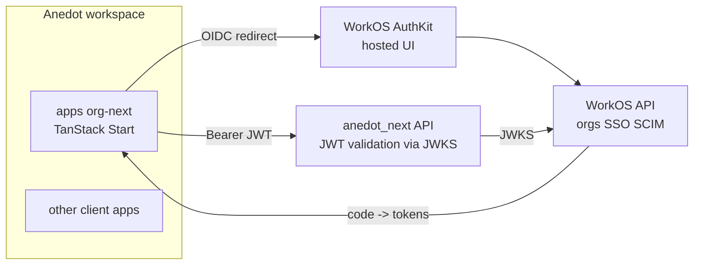

# Recommended External Auth: WorkOS AuthKit

## TL;DR

For a greenfield rebuild of this codebase, I recommend **WorkOS AuthKit** as the primary auth solution, with **Better Auth** as the strong open-source alternative if you want to avoid any vendor and **Clerk** as the alternative if pure React DX outranks cost. Cognito (the current pick under [apps/auth/docs/spec.md](apps/auth/docs/spec.md)) would not be my first choice greenfield given the DX trade-offs you already felt — it's the reason you have a whole [apps/auth](apps/auth) shell wrapping it.

## Why WorkOS AuthKit fits this workspace

This is a B2B, multi-tenant SaaS:
- `_authed` in [apps/org-next/src/routes/_authed.tsx](apps/org-next/src/routes/_authed.tsx) bootstraps a tenant and redirects to `/organizations/new` if none exists.
- The architecture under [apps/auth/docs/spec.md](apps/auth/docs/spec.md) is already a pure OIDC Authorization Code + PKCE redirect, with the backend at [anedot_next/doc/openapi.yaml](anedot_next/doc/openapi.yaml) validating bearer JWTs.

WorkOS hits all three of your priorities:

- **DX**
  - Drop-in hosted UI (AuthKit) replaces almost all of [apps/auth](apps/auth) — the spec'd Sign In, Sign Up, Confirm, Forgot, Reset, Force Change Password, MFA Challenge screens (~8 screens in [apps/auth/docs/spec.md](apps/auth/docs/spec.md)) are all built and maintained by WorkOS.
  - First-class **Organizations** primitive maps directly to your `tenants` model, so the bootstrap dance in [apps/org-next/docs/README.md](apps/org-next/docs/README.md) (lines 58–63) becomes simpler — `org_id` is in the JWT.
  - Standard OIDC, so the existing pattern in [apps/org-next/src/server/session.server.ts](apps/org-next/src/server/session.server.ts) (httpOnly access/refresh cookies + middleware that catches 401s) ports over almost unchanged.

- **Cost**
  - **1,000,000 MAU free** on the core tier (auth, orgs, social login, MFA, magic links, passkeys). Almost no realistic SaaS hits this in years 1–2.
  - You only pay per-connection for premium B2B features (SAML SSO, SCIM directory sync) — and those are revenue-justified because enterprise customers ask for them.
  - Compared to Clerk (~$0.02/MAU after 10k + per-org/SSO adders) you save a lot at scale.

- **Security**
  - SOC 2 Type II, ISO 27001, HIPAA, GDPR — vendor handles JWKS rotation, password hashing, breach detection, bot defense, brute-force protection.
  - Standard OIDC JWT means the backend ([anedot_next/doc/openapi.yaml](anedot_next/doc/openapi.yaml)) keeps validating bearer tokens via JWKS — only the issuer changes, no custom crypto on your side.
  - Built-in MFA (TOTP, SMS, passkeys) without you owning the UX from [apps/auth/docs/spec.md](apps/auth/docs/spec.md) sections 6–7.

## Why not the others

- **AWS Cognito (current)**
  - Cheap, but the DX is exactly why you built [apps/auth](apps/auth) — Hosted UI is rigid, custom-UI requires you to call `initiateAuth` / `respondToAuthChallenge` server-side ([apps/auth/docs/spec.md](apps/auth/docs/spec.md) sections 1, 6, 7) and own every screen, every challenge state, every error mapping.
  - No first-class organizations/SSO/SCIM — you'd have to build tenant→user mapping yourself.
  - Aggressive throttling and surprising error semantics (e.g. `UserNotFoundException` parity).

- **Clerk** — best React DX overall, but cost ramps quickly past 10k MAU (~$0.02/MAU plus per-org and per-SSO-connection charges), and it's Next-first; TanStack Start works but is less idiomatic.

- **Auth0** — mature and secure, but the most expensive of the bunch at scale and DX has stagnated. Avoid unless an enterprise deal mandates it.

- **Supabase / Firebase Auth** — fine for B2C, weak for B2B (no real orgs, SSO, SCIM stories). Wrong tool for this shape.

- **Better Auth** — genuinely strong runner-up: free, OSS, TS-native, plugin-based with `organization`, `sso`, `mfa`, `passkey` plugins, fits TanStack Start cleanly. Pick this if you want zero vendor lock-in and are comfortable owning the security ops (JWKS rotation, hardening, breach response). For most B2B teams, WorkOS's compliance posture is worth the trade.

## How it would slot into this codebase

What changes vs today:

- **Delete or shrink [apps/auth](apps/auth)**: AuthKit hosts every screen in [apps/auth/docs/spec.md](apps/auth/docs/spec.md). Keep a thin redirect endpoint only if you want a branded entry URL.
- **Keep the org-next session model**: the cookie shape in [apps/org-next/src/server/session.server.ts](apps/org-next/src/server/session.server.ts) and the 401-redirect middleware keep working — just point the OIDC provider at WorkOS instead of Cognito and read the `org_id` claim into `selectedTenantId`.
- **Backend ([anedot_next/doc/openapi.yaml](anedot_next/doc/openapi.yaml))**: rename `CognitoJwt` security scheme to `WorkOSJwt` (still `bearer`/`JWT`); swap the JWKS URL. No business logic changes.
- **Tenants**: map WorkOS Organizations 1:1 to your tenant model. Membership becomes a WorkOS API call instead of a custom API.

## Decision matrix

- DX: Clerk > **WorkOS** ≈ Better Auth > Auth0 > Cognito
- Cost at 100k MAU: Better Auth (free infra) > **WorkOS** (still free) > Cognito (~cheap) > Auth0 / Clerk (expensive)
- Security posture (vendor-managed): Auth0 ≈ **WorkOS** ≈ Clerk > Cognito > Better Auth (you own ops)
- B2B fit (orgs/SSO/SCIM): **WorkOS** > Auth0 ≈ Clerk > Better Auth > Cognito

WorkOS is the only option in the top group on **all three** of your stated priorities.

## Suggested next step

If you want, I can follow this with one of:
- A concrete migration plan from Cognito → WorkOS AuthKit for [apps/auth](apps/auth) and [apps/org-next](apps/org-next) (file-by-file).
- A side-by-side spike plan comparing WorkOS AuthKit vs Better Auth in a throwaway worktree.
- A PoC plan for just dropping AuthKit into [apps/org-next](apps/org-next) without touching the backend yet.
