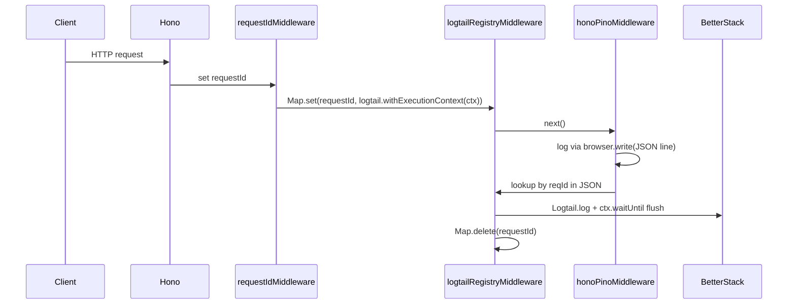

# Better Stack logging with hono-pino (Cloudflare Workers)

## Constraint (important)

The [Better Stack Pino transport docs](https://betterstack.com/docs/logs/javascript/pino/) use:

```js
pino.transport({ target: "@logtail/pino", options: { sourceToken, options: { endpoint } } })
```

That path **does not run on Cloudflare Workers**:

- `@logtail/pino` depends on `@logtail/node` and `pino-abstract-transport` (worker-thread transport).
- [hono-pino explicitly documents](https://github.com/maou-shonen/hono-pino) that on edge, `transports` are unsupported and **`browser.write` is the alternative**.

The repo already chose `@logtail/edge` in [DECISION_RECORD.md](DECISION_RECORD.md). The implementation below keeps **hono-pino + Pino APIs** (`c.var.logger`, existing [on-error.ts](apps/api/src/middlewares/on-error.ts)) while matching `@logtail/pino` forwarding semantics via `browser.write` + `@logtail/edge`.



## Current state

| Piece | Location | Notes |
|-------|----------|-------|
| Hono app on Workers | [wrangler.jsonc](apps/api/wrangler.jsonc), [src/index.ts](apps/api/src/index.ts) | `export default app` |
| hono-pino | [src/middlewares/pino-logger.ts](apps/api/src/middlewares/pino-logger.ts) | `nodeRuntime: false`, console-only today |
| Error logging | [src/middlewares/on-error.ts](apps/api/src/middlewares/on-error.ts) | `c.var.logger?.error(...)` — unchanged |
| `@logtail/edge` | [package.json](apps/api/package.json) devDependency + [pnpm catalog](pnpm-workspace.yaml) | Not wired yet |

## Implementation plan

### 1. Dependencies and env bindings

- Move `@logtail/edge` from `devDependencies` → `dependencies` (catalog `^0.5.8`).
- Do **not** add `@logtail/pino` to the Worker bundle (pulls `@logtail/node`). Copy the small level mapper from `@logtail/pino` helpers (~35 lines) into a local module instead.
- Extend [src/env.ts](apps/api/src/env.ts) `Bindings`:

```ts
LOGTAIL_SOURCE_TOKEN?: string
LOGTAIL_ENDPOINT?: string   // full URL, e.g. https://<ingesting-host>
```

- Update [wrangler.jsonc](apps/api/wrangler.jsonc) `secrets.required` to include `LOGTAIL_SOURCE_TOKEN` (production).
- Update [.dev.vars.example](apps/api/.dev.vars.example) with commented placeholders for local Better Stack source.
- Run `pnpm cf-typegen` (or `wrangler types`) after wrangler/env changes to refresh [worker-configuration.d.ts](apps/api/worker-configuration.d.ts).

### 2. Logtail client singleton — `src/lib/logtail.ts`

Per [Better Stack Workers docs](https://betterstack.com/docs/logs/cloudflare-worker/):

- Module-scoped `Logtail` instance created once when `LOGTAIL_SOURCE_TOKEN` + `LOGTAIL_ENDPOINT` are present.
- Export `getBaseLogtail(env)` and `isLogtailEnabled(env)`.
- No `ExecutionContext` on the singleton; scope it per request in middleware.

### 3. Pino → Logtail bridge — `src/lib/logtail-pino-write.ts`

Port the core loop from [@logtail/pino `pino.ts`](node_modules/@logtail/pino/src/pino.ts):

- Parse each Pino JSON line from `browser.write`.
- Map numeric `level` → Logtail `LogLevel` (same thresholds as `getLogLevel`).
- Build `meta` from fields other than `time`, `msg`, `message`, `level`, `v`.
- Call `logtail.log(msg, level, meta, stackContextHint)` on the **request-scoped** instance.

Export `createLogtailBrowserWrite(getLogtail: (reqId: string) => Logtail | undefined)` returning a `write(msg: string)` function.

### 4. Request-scoped registry — `src/middlewares/logtail-registry.ts`

Because hono-pino caches a single root Pino logger (see [hono-pino `middleware.ts`](node_modules/hono-pino/dist/index.js)), we cannot create a new `withExecutionContext(ctx)` logger per request inside `pino: (c) => ...` safely under concurrency.

**Safe pattern:** a `Map<string, Logtail>` keyed by `requestId`:

1. After [request-id middleware](apps/api/src/middlewares/request-id.ts), register `baseLogtail.withExecutionContext(c.executionCtx)` under `c.get('requestId')`.
2. `try/finally` delete the entry after `next()` so the map does not leak.
3. If Logtail is disabled (missing env), pass through with `next()` only.

Register middleware in [src/lib/create-app.ts](apps/api/src/lib/create-app.ts) **between** `requestIdMiddleware` and `pinoLogger()`.

### 5. Wire hono-pino — update [src/middlewares/pino-logger.ts](apps/api/src/middlewares/pino-logger.ts)

Keep existing hono-pino config (`nodeRuntime: false`, `referRequestIdKey: 'requestId'`, HTTP bindings). Change root Pino setup to:

```ts
// Static root options (not the dynamic (c) => child-only pattern)
pino: {
  level: 'info', // child still overridden per-request via existing (c) => ({ level }) if kept
  base: undefined,
  browser: {
    write: createLogtailBrowserWrite((reqId) => logtailRegistry.get(reqId)),
  },
},
```

**Dual output when Logtail is enabled:**

- Keep console visibility for `wrangler dev` / CF dashboard by composing writes: `console.log(msg)` then forward to Logtail when registry has a logger for `reqId`.
- When Logtail env is unset, behavior stays console-only (current dev/test experience).

**Note:** `hono-pino` passes dynamic `pino: (c) => ({ level })` as **child** options today; keep that for per-request `LOG_LEVEL` from `c.env`, and put `browser.write` on the static root config object passed as `pino` when it's an object—or pass a factory that returns a full `pino(...)` instance only if we confirm hono-pino won't cache it incorrectly. **Preferred:** use static root with `browser.write` + dynamic child `{ level: c.env.LOG_LEVEL ?? 'info' }` (current pattern).

### 6. Ops / docs

- [README.md](apps/api/README.md): document creating a [JavaScript source](https://telemetry.betterstack.com/team/0/sources/new?platform=javascript), setting `LOGTAIL_SOURCE_TOKEN` + `LOGTAIL_ENDPOINT` in `.dev.vars`, and `wrangler secret put LOGTAIL_SOURCE_TOKEN` for deploy.
- No change required to [src/middlewares/on-error.ts](apps/api/src/middlewares/on-error.ts) — it already uses Pino-shaped `c.var.logger`.

### 7. Tests

Existing Vitest tests ([src/routes/index.test.ts](apps/api/src/routes/index.test.ts)) use `LOG_LEVEL: 'silent'` and no Logtail env — should remain green (registry no-ops, no remote calls).

Optional follow-up (not required for initial integration): assert registry cleanup in a small unit test for the write helper.

## What we are explicitly not doing

- Using `pino.transport({ target: "@logtail/pino" })` in the Worker (Node-only).
- Replacing hono-pino or changing route handler logging APIs.
- Replacing Cloudflare’s built-in observability in [wrangler.jsonc](apps/api/wrangler.jsonc) (`observability.enabled`).

## Files to touch

| File | Action |
|------|--------|
| [apps/api/package.json](apps/api/package.json) | Move `@logtail/edge` to dependencies |
| [apps/api/src/lib/logtail.ts](apps/api/src/lib/logtail.ts) | **New** — base client |
| [apps/api/src/lib/logtail-pino-write.ts](apps/api/src/lib/logtail-pino-write.ts) | **New** — browser.write bridge |
| [apps/api/src/middlewares/logtail-registry.ts](apps/api/src/middlewares/logtail-registry.ts) | **New** — per-request `withExecutionContext` |
| [apps/api/src/middlewares/pino-logger.ts](apps/api/src/middlewares/pino-logger.ts) | Add `browser.write` + registry hookup |
| [apps/api/src/middlewares/index.ts](apps/api/src/middlewares/index.ts) | Export registry middleware |
| [apps/api/src/lib/create-app.ts](apps/api/src/lib/create-app.ts) | Register middleware order |
| [apps/api/src/env.ts](apps/api/src/env.ts) | Logtail bindings |
| [apps/api/wrangler.jsonc](apps/api/wrangler.jsonc), [.dev.vars.example](apps/api/.dev.vars.example), [README.md](apps/api/README.md) | Env + setup docs |
