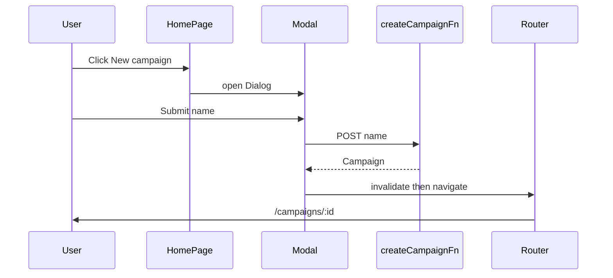

# Homepage modal for new campaign (TDD)

## Current state

- Create UI lives on a full-page route: [`apps/org-next/src/routes/_authed/campaigns/new.tsx`](apps/org-next/src/routes/_authed/campaigns/new.tsx) — form uses `SubmitEvent` + `FormData`, calls [`createCampaignFn`](apps/org-next/src/server/campaigns.functions.ts), navigates to [`/campaigns/$campaignId`](apps/org-next/src/routes/_authed/campaigns/$campaignId.tsx). Vendor guard is in `loadCampaignCreatePageFn` (redirect to `/`).
- Homepage [`apps/org-next/src/routes/_authed/index.tsx`](apps/org-next/src/routes/_authed/index.tsx) links to `/campaigns/new` in three places (onboarding CTA, “New campaign”, empty state).
- Playwright already has a create flow test against `/campaigns/new` in [`apps/org-next/tests/campaigns.spec.ts`](apps/org-next/tests/campaigns.spec.ts) (including POST/GET mocks and “no page errors” assertions). Vendor test still navigates to `/campaigns/new`.

## Target behavior

- **No dedicated create route** for the happy path: users create from the **homepage** via a **modal** (Radix/shadcn-style **`Dialog`** from `@workspace/ui` — [`packages/ui/src/components/ui/dialog.tsx`](packages/ui/src/components/ui/dialog.tsx)).
- **On success:** `navigate({ to: '/campaigns/$campaignId', params: { campaignId } })` (same as today). Call **`router.invalidate()`** before navigate so dashboard data can refresh when the user returns (align with existing TanStack patterns elsewhere).
- **Org-only:** Only render open triggers + modal when `currentTenant?.tenant_type === 'org'` (same rule as today’s [`canCreateCampaign`](apps/org-next/src/routes/_authed/index.tsx)).
- **Close:** `onOpenChange(false)` clears error state; optional `key` on the form to reset fields when reopening (small UX polish in REFACTOR).

## TDD steps (incremental)

### 1. RED — Playwright user flow on homepage

- Add or replace a test in [`apps/org-next/tests/campaigns.spec.ts`](apps/org-next/tests/campaigns.spec.ts) so the **primary** create flow is:
  - `page.goto('/')` with the same RMP mocks as today (`users/me`, `tenants`, `GET /campaigns?…`, then `POST /campaigns?…` + `GET /campaigns/:id?…` for the new id — mirror the existing create test’s mock **order** and patterns, including [`createCampaignPattern`](apps/org-next/tests/campaigns.spec.ts) if still needed).
  - From `/`, click **“New campaign”** (or another stable trigger you add, e.g. `getByRole('button', { name: /New campaign/i })`).
  - Assert the **dialog** is visible (`getByRole('dialog')` and/or `getByRole('heading', { name: /Create campaign/i })` inside it).
  - Fill the campaign name field (`#campaign-name` or label-linked textbox).
  - Submit; expect URL `/campaigns/<id>` and detail heading — reuse assertions from the current “creates a campaign…” test.
  - Keep or adapt **pageerror / console** guards from that test if they still add value.
- **Expect failure** until the modal exists on the homepage.

### 2. GREEN — Extract modal + wire homepage

- Add a focused component, e.g. [`apps/org-next/src/components/create-campaign-modal.tsx`](apps/org-next/src/components/create-campaign-modal.tsx) (name may vary), that:
  - Imports **`Dialog`, `DialogContent`, `DialogHeader`, `DialogTitle`, `DialogFooter`** (and close affordance via built-in close button or explicit `DialogClose`) from **`@workspace/ui`** only.
  - Accepts props like `open`, `onOpenChange`, and optionally `onCreated` or handles navigation internally with `useNavigate` + `useRouter` from `@tanstack/react-router`.
  - Moves the **same** form logic as today: `SubmitEvent<HTMLFormElement>`, `preventDefault` in a sync handler, async submit calling **`createCampaignFn`** from [`campaigns.functions.ts`](apps/org-next/src/server/campaigns.functions.ts) (per [AGENTS.md](apps/org-next/AGENTS.md) — client imports only from `*.functions.ts`).
- In [`index.tsx`](apps/org-next/src/routes/_authed/index.tsx):
  - Replace the three **`Link to="/campaigns/new"`** usages with **`Button`** + `onClick` that sets modal open (or `DialogTrigger` where it keeps layout simple).
  - Render **one** `<CreateCampaignModal … />` at the homepage level; only mount triggers when `canCreateCampaign` (vendor: no buttons, no modal).

### 3. GREEN — Remove the `/campaigns/new` route

- Delete [`apps/org-next/src/routes/_authed/campaigns/new.tsx`](apps/org-next/src/routes/_authed/campaigns/new.tsx) (or replace with a thin `redirect({ to: '/' })` if you want **bookmark compatibility** — optional; call out in PR if you add it).
- Let TanStack’s file router regenerate [`routeTree.gen.ts`](apps/org-next/src/routeTree.gen.ts) via dev/build.
- Update [`apps/org-next/docs/features/campaigns.md`](apps/org-next/docs/features/campaigns.md) and any other references to `/campaigns/new`.

### 4. RED/GREEN — Vendor + cleanup tests

- **Vendor test:** Stop using `/campaigns/new`. Assert on **`/`** that org-only CTAs are absent (e.g. no “New campaign” button) or that opening a dialog is impossible — match product expectation for vendor tenants.
- Remove or rewrite any remaining tests that **`goto('/campaigns/new')`**.
- Run **`pnpm exec vitest run`** and **`pnpm exec playwright test`** under [`apps/org-next`](apps/org-next) (per [toolchain](file:///Users/duhl/git/ui/.cursor/rules/toolchain.mdc): use **`mise exec --`** when invoking commands).

### 5. REFACTOR

- Deduplicate copy/styling between modal and any leftover patterns; ensure **accessible names** for dialog title and primary actions for stable Playwright selectors.
- Optional: `validateSearch` on `/` with `?newCampaign=1` to deep-link open modal — **out of scope** unless requested.

## Out of scope

- Changing API contracts or `createCampaignFn` validation.
- Campaign detail or list behavior beyond post-create navigation and optional `invalidate()`.
