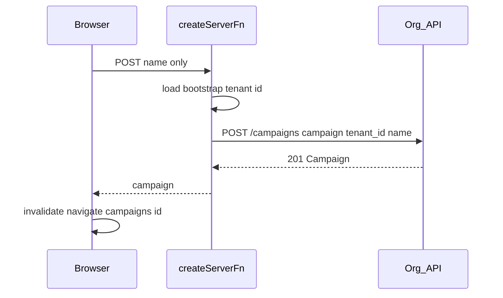

# Campaign creation from homepage (TDD + TanStack)

## API reality (drives UI shape)

From [apps/prototype-org-next/next-api.yaml](apps/prototype-org-next/next-api.yaml), **`CampaignCreate`** is:

- Wrapper: `{ campaign: { tenant_id, name } }` (`campaign` required; **`tenant_id` and `name` required** inside).
- Response: **`201`** with a **`Campaign`** (includes `id`, `tenant_id`, `name`, timestamps).

There are **no** start/end dates or goal fields on **create** in this schema. The current [apps/org-next/src/routes/_authed/campaigns/new.tsx](apps/org-next/src/routes/_authed/campaigns/new.tsx) UI exposes optional dates/goals **but only sends `name`** to the server today — those extras are either **future PATCH** work or should be **removed/simplified** until the API supports them.

## Modal vs new page — recommendation

| Approach | Fits API? | TanStack fit |
|----------|-----------|---------------|
| **Dedicated route** `/campaigns/new` (current) | Yes — only two fields | Strong: file route, deep links, back button, loaders, matches existing [`Link to="/campaigns/new"`](apps/org-next/src/routes/_authed/index.tsx) |
| **Full page** (like workspace/new) | Same | Same as above; different layout only |
| **True modal on `/` (Dialog, no navigation)** | Same | Weaker: need search-param + parallel route or parent state; harder to test and share URLs |

**Recommendation:** Keep **a dedicated file route** at `/campaigns/new`. The **presentational** “modal” (centered card on backdrop) is **fine** for a minimal create form and matches the API surface. If you want visual parity with [workspace/new](apps/org-next/src/routes/_authed/workspace/new.tsx), refactor layout to a full-page shell later — **no API change**.

## TDD sequence (Prove-It + pyramid)

Follow the skill’s **RED → GREEN → REFACTOR** loop. Prefer **state-based** assertions (redirect URL, campaign id visible), not internal call mocks in E2E.

### 1. RED — Vitest (small / fast)

- **Target:** `createCampaignForCurrentTenant` (or a renamed `createCampaign` in [`server/campaigns.ts`](apps/org-next/src/server/campaigns.ts)) calling `postOrgApiJson`.
- **Pattern:** Same as [`server/tenants.server.ts`](apps/org-next/src/server/tenants.server.ts): server-only module, **`postOrgApiJson<T>("/campaigns", { body })`**.
- **Tests (examples):**
  - Builds body `{ campaign: { tenant_id: <from bootstrap>, name: "X" } }` (mock `getAppBootstrapData` or a thin `getCurrentTenantId` helper used by the campaign module).
  - Maps `OrgApiError` / 401 consistently with [tenants](apps/org-next/src/server/tenants.server.ts) / existing [`createCampaignFn`](apps/org-next/src/routes/_authed/campaigns/new.tsx) handler.
- **Where:** Colocate under `src/server/` with existing vitest setup (org-next excludes Playwright from `vitest` via [vite.config.ts](apps/org-next/vite.config.ts)); use `*.test.ts` next to module or a `src/server/__tests__/` folder — match repo convention.

### 2. RED — Playwright integration (large, RMP)

- **New file:** e.g. [`tests/integration/campaign-create.spec.ts`](apps/org-next/tests/integration/) (mirror [workspace-new.spec.ts](apps/org-next/tests/integration/workspace-new.spec.ts)).
- **Flow:** With [`VITE_ENABLE_RMP`](apps/org-next/.env.test) + [`test-fixture`](apps/org-next/tests/integration/test-fixture.ts): mock `GET /users/me`, `GET /tenants` (user has a workspace), **`POST /campaigns`** → returned `Campaign`, then **`GET /campaigns/:id`** if the detail loader fetches by id.
- **Assertions:** After submit from `/campaigns/new`, URL matches `/campaigns/<id>` (and optional search `name` if you keep current behavior).
- **Hydration:** Reuse the same **`goto` + `networkidle` + non-CI delay** pattern if the controlled-input issue appears; align submit handler with **FormData + `required`** if needed (same lesson as workspace form).

### 3. GREEN — Server implementation

- **Replace** in-memory `fakeCampaigns` / fake `createCampaignForCurrentTenant` in [`server/campaigns.ts`](apps/org-next/src/server/campaigns.ts) with:
  - `postOrgApiJson<Campaign>("/campaigns", { campaign: { tenant_id, name } })`.
  - Resolve **`tenant_id`** from **server bootstrap** (e.g. `getAppBootstrapData()` and `tenant?.id` / `currentTenant`) — **do not** accept `tenant_id` from the client in the zod schema for `createCampaignFn` (security + single source of truth).
- **Optional refactor:** Move the handler’s import path to a **`campaigns.server.ts`** (or keep `campaigns.ts`) and keep **`createCampaignFn`** in a **`.functions.ts`** file per [AGENTS.md](apps/org-next/AGENTS.md) naming — only if the team wants parity with [`tenants.functions.ts`](apps/org-next/src/server/tenants.functions.ts).

### 4. GREEN — Post-create redirect shows real campaign

- Today [`getCampaignDetailPageData`](apps/org-next/src/server/campaigns.ts) reads **`fakeCampaigns`**. After create, **switch** to **`getOrgApiJson(`/campaigns/${id}`)** (or list+find if needed) so [`$campaignId`](apps/org-next/src/routes/_authed/campaigns/$campaignId.tsx) reflects the API. Playwright should mock **GET** for the detail request in the same spec.

### 5. REFACTOR — Homepage data (scope consciously)

- [`getDashboardPageData`](apps/org-next/src/server/dashboard.ts) is still **hardcoded**. **Out of minimum scope** unless product requires “new campaign appears on homepage list immediately.” If in scope: `GET /campaigns?tenant_id=…` and map to `DashboardPageData`; then **invalidate** router cache after create (already calls `router.invalidate()` in new.tsx).

## TanStack conventions checklist

- **`createServerFn`**: Input validator only **`name`** (trim, min 1); **handler** loads tenant and calls server-only API helper.
- **Navigation:** Keep `await router.invalidate()` + `navigate({ to: '/campaigns/$campaignId', params, search })` in [`campaigns/new.tsx`](apps/org-next/src/routes/_authed/campaigns/new.tsx) — already idiomatic.
- **Errors:** Reuse `OrgApiError` → redirect login on 401 like existing handler.
- **Route module:** Consider adding a **loader** on `/campaigns/new` to assert user has a tenant (redirect to `/workspace/new` if not), mirroring other authed flows — optional hardening.

## Verification

- `pnpm exec vitest run` (or targeted path) for new unit tests.
- `pnpm exec playwright test tests/integration/campaign-create.spec.ts` (and full `tests/integration/`).
- `pnpm run validate` before merge per toolchain rule.

## Out of scope / follow-ups

- Persisting **dates/goals** from the create UI → requires **API** `CampaignUpdate` or expanded `CampaignCreate` — track separately.
- **Prototype OpenAPI** may differ from production Rails — confirm with backend before locking request shapes.
