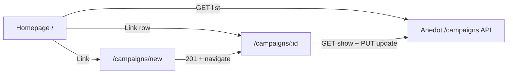

# Add campaigns for org tenants (source: anedot_next OpenAPI)

**Authoritative spec:** `[/Users/duhl/git/anedot_next/doc/openapi.yaml](/Users/duhl/git/anedot_next/doc/openapi.yaml)` — not `prototype-org-next`.

## API contract (campaigns)

From `paths` and `components/schemas`:

| Operation | Method  | Path              | Query params                                                             | Body                                                                                           |
| --------- | ------- | ----------------- | ------------------------------------------------------------------------ | ---------------------------------------------------------------------------------------------- |
| List      | GET     | `/campaigns`      | `[TenantId](components/parameters)`, `[VendorId](components/parameters)` | —                                                                                              |
| Create    | POST    | `/campaigns`      | same                                                                     | `[CampaignCreate](components/schemas)`: `{ campaign: { name } }` (wrapper `campaign` required) |
| Show      | GET     | `/campaigns/{id}` | `Id`, `TenantId`, `VendorId`                                             | —                                                                                              |
| Update    | **PUT** | `/campaigns/{id}` | same                                                                     | `[CampaignUpdate](components/schemas)`: `{ campaign: { name } }`                               |

`[Campaign](components/schemas)` resource: `id`, `name`, `created_at`, `updated_at`.

`[TenantId](components/parameters)` / `[VendorId](components/parameters)`: `tenant_id` and `vendor_id` as **integer query** parameters (“tenant context” / “vendor context when acting as a vendor”). They are **not** in the `CampaignCreate` body in this spec — scope is carried on the **query string**.

**Implication for org-next:** every campaign server call must build a URL like `/campaigns?tenant_id=<n>` (and `vendor_id=<n>` when the current workspace is vendor-scoped — map from bootstrap `[Tenant](apps/org-next/src/types/bootstrap.ts)` / backend rules; confirm with Rails if vendor orgs must always send `vendor_id`).

**Auth:** global `security: CognitoJwt` — already aligned with `[org-api.server.ts](apps/org-next/src/server/org-api.server.ts)` bearer token.

## Authorization: org-only campaign creation

**Product rule:** Only **org** workspaces (`tenant_type === "org"`) may **create** campaigns. **Vendor** tenants (`tenant_type === "vendor"` per `[Tenant](apps/org-next/src/types/bootstrap.ts)`) must **not** be able to create campaigns — enforce in **three places** so UI cannot be bypassed:

1. **Server functions (required):** `createCampaignFn` (and any future server entry that POSTs `/campaigns`) must read bootstrap / current tenant and **reject** with a clear error (e.g. 403-shaped failure or structured `{ error }`) when `currentTenant.tenant_type !== "org"`. Never rely on the client to send tenant type.
2. **Routes / loaders:** `[/_authed/campaigns/new](apps/org-next/src/routes/_authed/campaigns/new.tsx)` should **redirect** (e.g. to home or dashboard) or show **not found** when the current tenant is vendor, so deep links and refresh do not expose the create form.
3. **UI affordances:** Hide or disable **“New campaign”** (and any entry points to `/campaigns/new`) when `tenant_type === "vendor"` — use the same bootstrap source as the rest of the app for consistency.

**Note:** This scope is **create-only** unless product says otherwise. List/show/update behavior for vendor tenants should follow whatever the API and product allow; if the backend also forbids vendor campaign mutation, mirror that in server functions after confirming with the API team.

## UI: modal vs dedicated route

- **Create:** The API only requires a **campaign name** in the body (plus query scope). That is small enough for a **modal-style UI**, but org-next already uses a **file route** `[/_authed/campaigns/new](apps/org-next/src/routes/_authed/campaigns/new.tsx)` with a centered card (modal-like). **Recommendation:** keep a **dedicated route** `/campaigns/new` for deep links, refresh, and TanStack Router loaders; keep or simplify the current overlay layout. Avoid a homepage-only Dialog unless product requires staying on `/` without a URL change.
- **View + edit:** OpenAPI has no separate “edit” URL — **GET** + **PUT** on `/campaigns/{id}`. **Recommendation:** use the existing dynamic route `[/_authed/campaigns/$campaignId](apps/org-next/src/routes/_authed/campaigns/$campaignId.tsx)` as the **canonical campaign view**; add an **edit** affordance on that page (inline form, “Settings” card, or `?edit=1` search param) that calls `**updateCampaign`** via a server function. After create, **redirect** to `/campaigns/$id` (already partially implemented).

## UI components (@workspace/ui + TanStack)

**Rule:** All shadcn-style primitives come from `**@workspace/ui`** (`[packages/ui/src/index.ts](packages/ui/src/index.ts)`) — do not add parallel shadcn installs in `org-next`.

### TanStack (routing / data)

- **[@tanstack/react-router](https://tanstack.com/router):** `createFileRoute`, `Link`, `redirect`, `useNavigate`, `useRouter`, `useParams`, route `loader` / `validateSearch` for campaign detail and optional edit mode.
- **[@tanstack/react-start](https://tanstack.com/start):** `createServerFn` for `createCampaignFn`, `updateCampaignFn`, and any loader-backed server functions per [AGENTS.md](apps/org-next/AGENTS.md) (`*.functions.ts` vs `*.server.ts`).
- **Optional:** `@tanstack/react-query` only if we introduce client-side cache for campaign detail; prefer **router loaders** + `router.invalidate()` first to stay aligned with existing patterns.

### @workspace/ui — create campaign (`/campaigns/new`)

| Use                             | Components (import from `@workspace/ui`)                                                                                                                                                                                      |
| ------------------------------- | ----------------------------------------------------------------------------------------------------------------------------------------------------------------------------------------------------------------------------- |
| Page shell / modal card         | `Card`, `CardHeader`, `CardTitle`, `CardDescription`, `CardContent`, `CardFooter` (`[components/ui/card.tsx](packages/ui/src/components/ui/card.tsx)`)                                                                        |
| Actions                         | `Button` (variants: default submit, outline cancel, ghost icon close) (`[components/ui/button.tsx](packages/ui/src/components/ui/button.tsx)`)                                                                                |
| Campaign name                   | `Input`, `Label` (`[input](packages/ui/src/components/ui/input.tsx)`, `[label](packages/ui/src/components/ui/label.tsx)`); set `name="name"` on `Input` if using FormData + server trim (same robustness as workspace create) |
| Structure                       | `Separator` (`[separator](packages/ui/src/components/ui/separator.tsx)`) between header / body / footer as needed                                                                                                             |
| Loading                         | `Skeleton` for initial shell; `LoadingSpinner` (`[loading-spinner](packages/ui/src/components/ui/loading-spinner.tsx)`) or existing Lucide `Loader2` on the submit button — match surrounding org-next screens                |
| Optional sections (dates/goals) | If kept in UI before API support: `Collapsible`, `CollapsibleTrigger`, `CollapsibleContent` (`[collapsible](packages/ui/src/components/ui/collapsible.tsx)`) instead of bespoke toggle `Button`s                              |

**Org-next local wrappers:** Continue using `[Field](apps/org-next/src/components/ui/field.tsx)` + `[FieldLabel](apps/org-next/src/components/ui/field.tsx)` around `Input` for consistency with [workspace/new](apps/org-next/src/routes/_authed/workspace/new.tsx), or align labels with `Label` from `@workspace/ui` — pick one pattern per screen.

### @workspace/ui — campaign detail + edit (`/campaigns/$campaignId`)

| Use                                     | Components                                                                                                                                                                                                                                                          |
| --------------------------------------- | ------------------------------------------------------------------------------------------------------------------------------------------------------------------------------------------------------------------------------------------------------------------- |
| Wayfinding                              | `Breadcrumb`, `BreadcrumbList`, `BreadcrumbItem`, `BreadcrumbLink`, `BreadcrumbPage`, `BreadcrumbSeparator` (`[breadcrumb](packages/ui/src/components/ui/breadcrumb.tsx)`) e.g. Home → Campaign                                                                     |
| Page layout                             | `PageLayout` (`[page-layout](packages/ui/src/components/page-layout.tsx)`) and/or `FormPageLayout` (`[layouts/form-page-layout](packages/ui/src/components/layouts/form-page-layout.tsx)`) for a settings-style section with title, description, and footer actions |
| Section chrome                          | `Card` (+ header/content/footer), `Separator`                                                                                                                                                                                                                       |
| Edit campaign name                      | `Input`, `Label`, `Button` (Save / Cancel)                                                                                                                                                                                                                          |
| Loading / empty                         | `Skeleton` while loader resolves; `Paragraph` / `Heading` from `[typography](packages/ui/src/components/typography/)` for empty or error copy                                                                                                                       |
| Destructive / confirm (optional polish) | `AlertDialog` (`[alert-dialog](packages/ui/src/components/ui/alert-dialog.tsx)`) e.g. discard unsaved edits                                                                                                                                                         |

### Optional: homepage-triggered create (only if UX requires staying on `/`)

- `Dialog`, `DialogContent`, `DialogHeader`, `DialogTitle`, `DialogFooter` (`[dialog](packages/ui/src/components/ui/dialog.tsx)`), or the higher-level `**AppDialog`** (`[app-dialog](packages/ui/src/components/app-dialog.tsx)`) with a `Button` trigger — same form fields as above inside the dialog.

### New components to add to `@workspace/ui` (only if MVP needs them)

| Candidate                                                                                    | When to add                                                                                                                                                                                                                                                                   |
| -------------------------------------------------------------------------------------------- | ----------------------------------------------------------------------------------------------------------------------------------------------------------------------------------------------------------------------------------------------------------------------------- |
| **shadcn Form** (`Form`, `FormField`, `FormItem`, `FormLabel`, `FormControl`, `FormMessage`) | Add under `packages/ui/src/components/ui/form.tsx` and export from `index.ts` **only if** we implement client-side validation with `react-hook-form` + Zod for campaign edit/create. **MVP can skip:** server `zod` in `createServerFn` + inline error `Paragraph` is enough. |
| **Nothing else**                                                                             | Breadcrumb, Card, Dialog, Collapsible, etc. already exist in the package.                                                                                                                                                                                                     |

If Form primitives are added later, follow the official [shadcn/ui Form](https://ui.shadcn.com/docs/components/form) recipe and re-export from `@workspace/ui` for single-source styling.

## Gaps in org-next today

1. `**[server/campaigns.ts](apps/org-next/src/server/campaigns.ts)**` uses **in-memory fakes**; must call the real API.
2. `**[org-api.server.ts](apps/org-next/src/server/org-api.server.ts)`** exposes `getOrgApiJson` / `postOrgApiJson` only (`GET` / `POST`). The spec needs `**PUT`** for update and **consistent query-string construction** for `tenant_id` / `vendor_id` (today `new URL(path, base)` with a path-only string is fragile for scoped resources).
3. `**[createCampaignFn](apps/org-next/src/routes/_authed/campaigns/new.tsx)`** should pass only `**name`** from the client; **tenant/vendor scope** must be resolved **server-side** from `[getAppBootstrapData](apps/org-next/src/server/app-bootstrap.ts)` (or equivalent), never trusted from the browser.
4. **Optional UI fields** (dates, goals) on the create page are **not** in `CampaignCreate` / `CampaignUpdate` in this OpenAPI — either remove them from MVP or gate behind a follow-up once the API supports them.

## Implementation plan (TanStack-aligned)

### 1. Server layer (foundation)

- Add `**putOrgApiJson`** (or extend `requestOrgApiJson` with `method: 'PUT'`) in `[org-api.server.ts](apps/org-next/src/server/org-api.server.ts)`.
- Add a small **internal helper** to build scoped paths, e.g. `orgApiPath('/campaigns', { tenantId, vendorId })` → `URL` with `searchParams`, so list/create/show/update all share one convention.

### 2. Campaign module

- Replace `createCampaignForCurrentTenant` / fake list with:
  - `**createCampaignForCurrentTenant(name)`** → `POST` scoped path + body `{ campaign: { name } }`.
  - `**getCampaign(id)`** → `GET /campaigns/{id}` with scope query params.
  - `**updateCampaign(id, { name })`** → `PUT` + body `{ campaign: { name } }`.
  - `**listCampaigns()`** → `GET /campaigns` with scope (required for homepage list).
- Resolve **scope** in one place: read current tenant from bootstrap; set `tenant_id`; set `vendor_id` only when required for vendor context (integer coercion — align with backend if `vendor_id` in bootstrap is string).

### 3. Server functions (`.functions.ts` per AGENTS.md)

- Keep `**createCampaignFn`** input as `**{ name }`** only; handler calls campaign server module.
- **Gate create on org tenant:** before POST, assert `currentTenant.tenant_type === "org"` from bootstrap; otherwise return a typed error (no API call).
- Add `**updateCampaignFn`** with zod `{ campaignId: string, name: string }` (or similar) for edit.
- Optionally add `**getCampaignPageDataFn`** if you want loaders to use server functions consistently.

### 4. Routes

- `**/campaigns/new`:** **Vendor guard:** loader or `beforeLoad` redirects non-org tenants away from the create form. Ensure submit uses server fn + `**router.invalidate()`** + `**navigate`** to `/campaigns/$campaignId` with search if needed (existing pattern).
- `**/campaigns/$campaignId`:** Load campaign via `**getCampaign`** in loader or parent; **replace** demo/scenario content with a **very basic layout**: show only **Campaign** fields from OpenAPI (`id`, `name`, `created_at`, `updated_at`). Add **edit name** UI wired to `**updateCampaignFn`** as already planned. Handle 404 from API. **Do not** add payments, invites, contacts, or any other resource sections on this page.

### 5. Homepage — basic campaign list

- Wire the authenticated **homepage** (`/` or whatever file route serves the main dashboard) to **`listCampaigns()`** (real `GET /campaigns`) via loader or dashboard data helper — replace or extend mocked campaign data in `[getDashboardPageData](apps/org-next/src/server/dashboard.ts)` as appropriate.
- Render a **simple list** (e.g. `Card` + `Link` rows or a minimal table) of campaign names; each row navigates to **`/campaigns/$campaignId`**.
- **Scope:** same `tenant_id` / `vendor_id` rules as other campaign calls. Respect **org-only create** for “New campaign” CTAs; list visibility follows API + product (vendor may see list per earlier note).
- **Explicit non-goals:** no payments UI, no invites UI, no nested entities—**campaign rows and links only**.

## TDD / test strategy

Follow **standard TDD** (Kent Beck–style): **RED → GREEN → REFACTOR**, repeated in **small, incremental** steps so each change is justified by a failing test and reliability stays high. Do **not** write large batches of production code ahead of tests.

### Principles

1. **RED — Write a failing test first.** Prefer starting from the **user-visible flow** (Playwright integration: navigate, fill, submit, land on detail, etc.) so the outer loop proves behavior end-to-end. Add **narrower tests** (Vitest on URL builders, request shapes, org-only gate) as you extract or harden modules — each new assertion should fail before the corresponding code exists or is correct.
2. **GREEN — Implement the minimum** to make that test pass — no extra features, no speculative APIs. If the test is too big, **split the next RED** into a smaller scenario (e.g. one flow per example: “create only,” then “rename,” then “vendor blocked from create”).
3. **REFACTOR — Only after green.** Improve names, deduplicate scope helpers, align types — **tests stay green** throughout. If a refactor breaks behavior, you are missing a test; add RED for that case, then GREEN, then refactor again.

### Incremental slices (example order)

Work **vertical slices** (e.g. org-api `PUT` + path helper → campaign module create → server fn → route → next slice), and at **each** slice apply RED / GREEN / REFACTOR before piling on the next. Avoid “implement everything then fix tests.”

### Concrete tests to include

- **RED — Playwright (user flow):** Specs live under `[tests/](apps/org-next/tests/)` — **not** under `tests/integration/`. Use **request-mocking-protocol** in the same style as [workspace-new.spec.ts](apps/org-next/tests/workspace-new.spec.ts). Mock `POST /campaigns` (with query), then `GET /campaigns/:id` for detail; assert navigation after create; optionally a second test for rename (PUT). Add coverage that **vendor** bootstrap cannot reach create (redirect / blocked server fn) if feasible with existing RMP bootstrap fixtures. Add flows for **homepage list** (mock `GET /campaigns`) and **click row → detail** shows basic campaign info only.
- **RED — Vitest (units):** With **mocked `fetch`** or mocked `requestOrgApiJson`, assert:
  - Correct **query** (`tenant_id`, optional `vendor_id`) on POST/GET/PUT.
  - Correct **JSON body** shape `{ campaign: { name } }`.
  - `PUT` used for update.
  - **Create path:** when bootstrap resolves to a **vendor** tenant, create does **not** call POST `/campaigns` (or returns the agreed error shape).

### Definition of done for the TDD loop

Feature work is “TDD-complete” when user-flow tests and unit tests pass, refactors are done with **no behavior change**, and `pnpm run validate` is green before merge (see Verification).

## Verification

- `pnpm exec vitest run` (targeted) and `pnpm exec playwright test tests/…` (paths under `[apps/org-next/tests/](apps/org-next/tests/)`, not `tests/integration/`).
- `pnpm run validate` at repo root before merge.

## Out of scope (unless API gains fields later)

- Campaign pages (`/campaign_pages`), contacts, payments — separate OpenAPI sections.
- **Payments, invites, and any non-`Campaign` entities** on the homepage list or `/campaigns/$id` detail page—this slice is **list + minimal campaign record + create/edit name** only.
- Extra create UI (dates/goals) not present in `CampaignCreate` in this spec.

