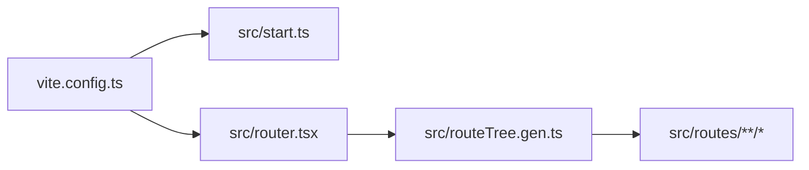

# Dead code check for `org-next`

## Current baseline

- **[apps/org-next/tsconfig.json](apps/org-next/tsconfig.json)** already has `noUnusedLocals` and `noUnusedParameters`. That covers **private** (non-exported) functions, variables, and parameters that are unused **within the same file**. It does **not** detect unused **exports**, orphan **files**, or types only referenced from unused code.
- **[apps/org-next/package.json](apps/org-next/package.json)** has no Knip, `ts-prune`, or similar. **Biome** ([apps/org-next/biome.jsonc](apps/org-next/biome.jsonc)) does not report unused exports or unreachable files across the module graph.
- The app’s route graph is **statically imported** via **[apps/org-next/src/routeTree.gen.ts](apps/org-next/src/routeTree.gen.ts)** (imported from [apps/org-next/src/router.tsx](apps/org-next/src/router.tsx)), which is favorable for import-graph tools (no string-based `import('./foo')` route loading in this app).

## Recommended approach: Knip

Use **[Knip](https://github.com/webpro-nl/knip)** as the single tool for:

| Your ask | Mechanism |
|----------|-----------|
| Files that are not imported | Knip **unused files** (reachable from configured `entry` files) |
| Exported functions/types not imported elsewhere | Knip **unused exports** |
| Exported symbols neither imported elsewhere **nor** used in the defining module | Knip unused exports (exports with zero references anywhere, including same file) |

Knip is preferable to **`ts-prune` alone** because `ts-prune` only addresses unused exports, not orphan files, and has weaker project/framing story.

### Why not rely only on TypeScript?

`tsc` does not compute “reachable from app entry” for **files**. Exported members are considered “used” if they are part of the public API of a module, even when nothing imports that module.

---

## Configuration sketch (implementation phase)

1. **Add Knip** as a devDependency of `org-next` (pin a current major; add to [pnpm catalog](https://github.com/) at repo root if that matches how other dev tools are versioned in this monorepo).

2. **Add `knip.json` (or `knip` key in package.json)** in [apps/org-next/](apps/org-next/) with:
   - **`entry`**: files that must be treated as roots so server-only, test-only, and tooling code are not false “unused files.” Minimum set to validate:
     - [apps/org-next/vite.config.ts](apps/org-next/vite.config.ts)
     - [apps/org-next/src/start.ts](apps/org-next/src/start.ts) and [apps/org-next/src/router.tsx](apps/org-next/src/router.tsx) (they pull in `routeTree.gen` and thus all route modules)
     - [apps/org-next/playwright.config.ts](apps/org-next/playwright.config.ts) (so [apps/org-next/tests/\*\*/*.spec.ts](apps/org-next/tests/) is connected)
     - Colocated tests: e.g. `src/**/*.test.ts` / `src/**/*.test.tsx` (Vitest; see `vite.config.ts` `test` block)
   - **`ignore` / `ignoreDependencies`**: as needed after a first run (framework noise).
   - **Ignore generated / non-TS artifacts** already excluded from Biome where relevant: e.g. `routeTree.gen.ts` may need to be excluded from *certain* Knip rules or left as-is (it is imported, so it should not appear as an unused file; generated churn is usually managed via `ignore`).

3. **Optional Knip plugins** (if supported in the Knip version you pin): `vite`, `vitest`, `playwright` — reduces manual `entry` duplication by reading configs.

4. **Add a script** such as `"knip": "knip"` under `org-next` scripts so `pnpm --filter org-next knip` is repeatable and can be wired into CI later.

---

## Import graph sanity (TanStack Start + Nitro)

Anything under `src/` that is **not** reachable from the chosen `entry` set will be reported as an unused file—**unless** it is listed as an entry (tests, Playwright helpers) or ignored for a documented reason.

---

## Known false-positive patterns to triage manually

- **MSW / browser worker** — [apps/org-next/src/mocks/browser.ts](apps/org-next/src/mocks/browser.ts) is not imported anywhere in-repo today (grep shows no `from "@/mocks/browser"`). Knip may correctly flag it as dead **or** it may be intended for future wiring; team judgment required.
- **Declaration-only files** — `vite-env.d.ts`, `global.d.ts`, `fonts.d.ts`: configure Knip `ignore` or `ignoreFiles` so ambient types are not noisy.
- **Barrel files** — if you add `index.ts` re-exports, unused exports may be reported at the barrel or at the leaf; prefer consistent export policy.
- **Dynamic `import()`** — if introduced later, add those paths as `entry` or use Knip’s support for lazy imports (version-dependent).

---

## Execution workflow (when you leave plan mode)

1. Install Knip and add config + script.
2. Run `pnpm --filter org-next knip` (from monorepo root) and save the first report.
3. For each finding: remove dead code, **or** add a justified `ignore` with a comment in `knip.json`, **or** add a missing `entry` if the file is a legitimate root (e.g. new test harness).
4. Keep **`pnpm typecheck`** green; Knip is complementary to `noUnusedLocals`.

---

## Scope note

This plan targets **`apps/org-next` only**. To extend the same methodology to other `apps/*` or `packages/*`, use Knip’s **workspaces / monorepo** mode from the repo root or duplicate per-package configs—whichever matches how this monorepo standardizes tooling.
