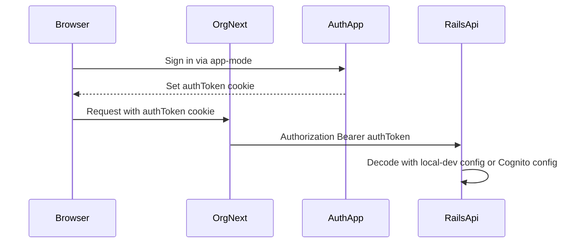

# Debug Bearer Auth

## Likely Failure Point

For this flow, `org-next` is not supposed to know `LOCAL_DEV_JWT_SECRET`; it only reads the signed `authToken` cookie and forwards it as `Authorization: Bearer <token>` in [`apps/org-next/src/server/org-api.server.ts`](apps/org-next/src/server/org-api.server.ts). In local dev, the shared secret that matters for backend authorization is between [`apps/auth/src/lib/local-dev-jwt.ts`](apps/auth/src/lib/local-dev-jwt.ts) and [`../anedot_next/app/services/cognito_jwt_validator.rb`](../anedot_next/app/services/cognito_jwt_validator.rb).

## Debug Steps

1. Confirm the three local env contracts are aligned:
   - `apps/auth/.env.local`: `ANEDOT_LOCAL_DEV=true`, `LOCAL_DEV_JWT_SECRET=<32+ chars>`, `ORG_NEXT_SESSION_SECRET=<same as org-next SESSION_SECRET>`, and `AUTH_APPS` with `org-next` pointing at `ORG_NEXT_SESSION_SECRET`.
   - `apps/org-next/.env.local`: `SESSION_SECRET=<same as ORG_NEXT_SESSION_SECRET>`, `ANEDOT_API_URL_BASE=http://localhost:3000`, `VITE_AUTH_APP_URL=http://localhost:3208`.
   - `../anedot_next/.env` or `.env.development.local`: `ANEDOT_LOCAL_DEV=true`, `LOCAL_DEV_JWT_SECRET=<same as apps/auth>`.

2. Restart all three dev servers after env edits. The auth docs explicitly call out that env files do not hot-reload for `AUTH_APPS`, and Rails initializers load Cognito config at boot.

3. Clear stale cookies for `localhost:3208` and the org-next host, then sign in again. This removes tokens minted under an older secret or mode.

4. Verify whether `org-next` is forwarding a token at all:
   - The relevant path is [`apps/org-next/src/server/session.server.ts`](apps/org-next/src/server/session.server.ts) reading cookie `authToken` with `SESSION_SECRET`, then [`apps/org-next/src/server/org-api.server.ts`](apps/org-next/src/server/org-api.server.ts) forwarding it.
   - If org-next redirects to `/login`, suspect `SESSION_SECRET` mismatch between auth and org-next.
   - If Rails returns `401`, suspect Rails local-dev config or JWT secret mismatch.

5. Decode the token payload locally without verifying the signature to inspect shape, not the secret. The local-dev access token should have `alg: HS256`, `token_use: access`, `iss: anedot-local-dev`, `client_id: anedot-local-dev`, `email`, `sub`, and a future `exp`, matching [`apps/auth/INTEGRATING.md`](apps/auth/INTEGRATING.md).

6. In Rails, test the exact bearer token with `CognitoJwtValidator.new(token).decode` in `bin/rails console` to get the real validation error. The API currently collapses all validator failures to `{ error: "Unauthorized" }` in [`../anedot_next/app/controllers/concerns/cognito_jwt_authentication.rb`](../anedot_next/app/controllers/concerns/cognito_jwt_authentication.rb), so the console is the fastest way to see whether it is `Local dev JWT secret not configured`, bad signature, expired token, wrong `token_use`, or missing claims.

7. If Rails is not in local-dev mode, it will try RS256 Cognito validation instead. Then check `COGNITO_USER_POOL_ID`, `COGNITO_CLIENT_ID`, `COGNITO_REGION`, and ensure the token is a Cognito access token, not the local HS256 token.

## Important Source References

- Cookie reader: [`apps/org-next/src/server/session.server.ts`](apps/org-next/src/server/session.server.ts)
- Bearer forwarding: [`apps/org-next/src/server/org-api.server.ts`](apps/org-next/src/server/org-api.server.ts)
- Local JWT minting: [`apps/auth/src/lib/local-dev-jwt.ts`](apps/auth/src/lib/local-dev-jwt.ts)
- Auth app setup and troubleshooting: [`apps/auth/INTEGRATING.md`](apps/auth/INTEGRATING.md)
- Rails Cognito/local-dev initializer: [`../anedot_next/config/initializers/cognito.rb`](../anedot_next/config/initializers/cognito.rb)
- Rails validator: [`../anedot_next/app/services/cognito_jwt_validator.rb`](../anedot_next/app/services/cognito_jwt_validator.rb)