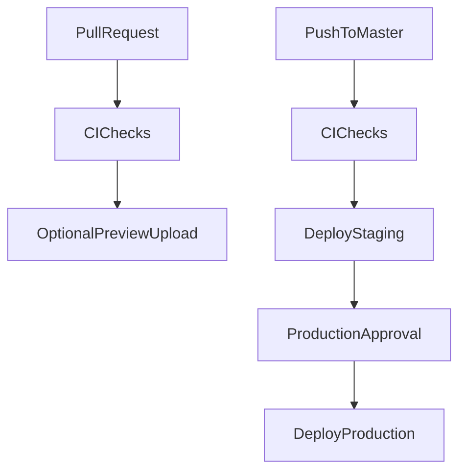

# GitHub Deployment Pipeline

## Recommended Environment Flow

- **Pull requests:** run CI only, plus optional preview uploads. Do not deploy to shared `dev`, `staging`, or `production` automatically from arbitrary PRs. Shared environments get overwritten too easily and can expose unreviewed code.
- **Dev:** use either PR preview versions or a manually triggered deploy from a chosen branch/SHA. `api` already has `api-dev` in [apps/api/wrangler.jsonc](apps/api/wrangler.jsonc), but `web` does not currently define `web-dev` in [apps/web/wrangler.jsonc](apps/web/wrangler.jsonc), so a persistent dev web Worker would need to be added intentionally.
- **Staging:** deploy automatically after CI passes on pushes to `master`/`main`. This gives every merged commit a real integration environment before production.
- **Production:** deploy from the exact same commit only after staging succeeds and a GitHub Environment approval is granted, or from a release tag if you prefer tag-based releases. The safer default is one workflow run: `check -> deploy_staging -> deploy_production`, with production gated by `environment: production` required reviewers.

## Correctness Guardrails

- Keep the existing CI trigger in [.github/workflows/ci.yml](.github/workflows/ci.yml), but expand it beyond `pnpm check` to include at least `pnpm typecheck`, relevant tests, and builds before deployment.
- Add a deploy workflow or deploy jobs that use GitHub Environments named `staging` and `production`, with separate secrets per environment: `CLOUDFLARE_API_TOKEN`, `CLOUDFLARE_ACCOUNT_ID`, plus app-specific secrets.
- Deploy `api` with Wrangler's environment flag because it is a regular Worker config:

```bash
pnpm --dir apps/api exec wrangler deploy --env staging --minify
pnpm --dir apps/api exec wrangler deploy --env production --minify
```

- Deploy `web` by selecting the Cloudflare environment at build time, then deploying the generated config without `--env`:

```bash
CLOUDFLARE_ENV=staging pnpm build:web
pnpm --dir apps/web exec wrangler deploy

CLOUDFLARE_ENV=production pnpm build:web
pnpm --dir apps/web exec wrangler deploy
```

This matters because `@cloudflare/vite-plugin` writes `apps/web/dist/server/wrangler.json`, and Wrangler deploys that generated file. Passing `wrangler deploy --env staging` after the build does not reliably produce `web-staging`.

## Suggested Workflow Shape



## Implementation Notes

- Use `concurrency` per environment so two pushes do not race deployments, for example `deploy-staging` and `deploy-production` groups.
- Use GitHub branch protection so PRs cannot merge unless CI passes.
- Use GitHub Environment protection on `production` for required reviewers and secret isolation.
- Have each deploy job print or verify the resolved Worker name before deploying. For `web`, inspect `apps/web/dist/server/wrangler.json` after build and fail if `name` is not `web-staging` or `web-production` for the intended target.
- If persistent `dev` is desired, add `web-dev` to [apps/web/wrangler.jsonc](apps/web/wrangler.jsonc) and expose it through `workflow_dispatch`, rather than auto-deploying every feature branch to the same Worker.