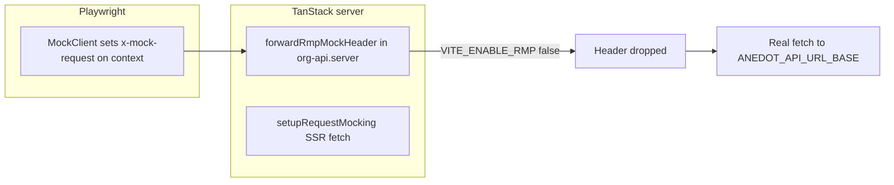

# Fix org-next e2e failures (RMP disabled in e2e env)

## Root cause

Playwright tests use `MockClient` from `request-mocking-protocol` in [`tests/test-fixture.ts`](apps/org-next/tests/test-fixture.ts), which sets the `x-mock-request` header on the browser context so each test can define `GET/POST` responses for the Org API.

For that to work end-to-end, two things must be true (documented in [`docs/README.md`](apps/org-next/docs/README.md) under “Request mocking for tests”):

1. **Server forwards the mock header** — [`src/server/org-api.server.ts`](apps/org-next/src/server/org-api.server.ts) `forwardRmpMockHeader()` returns `{}` when `env.VITE_ENABLE_RMP` is false, so outbound `fetch` to `ANEDOT_API_URL_BASE` never carries `x-mock-request`.

2. **SSR installs the fetch interceptor** — [`src/router.tsx`](apps/org-next/src/router.tsx) only calls `setupRequestMocking()` (from [`packages/test-utils/src/request-mocking.ts`](packages/test-utils/src/request-mocking.ts)) when `env.VITE_ENABLE_RMP` is true.

Committed [`.env.e2e`](apps/org-next/.env.e2e) has **`VITE_ENABLE_RMP=false`**, which contradicts the docs and disables the entire mocking pipeline. Unmocked server functions (`getAppBootstrapData`, campaign loaders, `createTenant`, etc.) then hit `http://localhost:3000` (see `ANEDOT_API_URL_BASE` in the same file) with no live backend or wrong responses — producing redirects to `/login`, loader errors, missing UI copy (“No tenants yet”), and broken campaign flows. That matches the **eight** failing tests you listed, which all rely on mocked `/users/me`, `/tenants`, and `/campaigns` responses.

The **three** passing tests are consistent with weaker assertions (e.g. [`tests/smoke.spec.ts`](apps/org-next/tests/smoke.spec.ts) only checks the document title “Org Next”, which is set in [`src/routes/__root.tsx`](apps/org-next/src/routes/__root.tsx) `head` regardless of loader success) or error-boundary behavior that can appear even when mocks are wrong.

## Fix

1. **Set `VITE_ENABLE_RMP=true` in [`.env.e2e`](apps/org-next/.env.e2e)** (replace the current `false` value). Optionally add a one-line comment that Playwright requires this so mocks apply on the server.

2. **Re-run the suite** from the app (or monorepo per your workflow): `pnpm run e2e` in `apps/org-next` with mise toolchain. All eight previously failing specs should pass if this was the only regression.

3. **Docs check**: [`docs/README.md`](apps/org-next/docs/README.md) already states that e2e mocking requires `VITE_ENABLE_RMP=true`. No doc rewrite is required unless you add new assumptions (e.g. explicitly noting “`.env.e2e` must keep RMP enabled for CI/local e2e”). Only add a short bullet if the team wants `.env.e2e` to be self-documenting alongside code — optional per your “keep docs sparse” rule.

## If anything still fails after enabling RMP

- Confirm the preview build used in CI picks up `VITE_*` for `--mode e2e` (Playwright already loads `.env.e2e` before starting Vite; verify no override strips `VITE_ENABLE_RMP`).
- Compare actual request URLs in trace/HTML report to regexes in [`tests/get-mock-api-urls.ts`](apps/org-next/tests/get-mock-api-urls.ts) (query param order for `tenant_id` / `vendor_id` is stable via [`orgApiScopedPath`](apps/org-next/src/lib/org-api-scoped-path.ts)).

No application code changes are expected for the common case—this is configuration alignment with the documented RMP contract.
