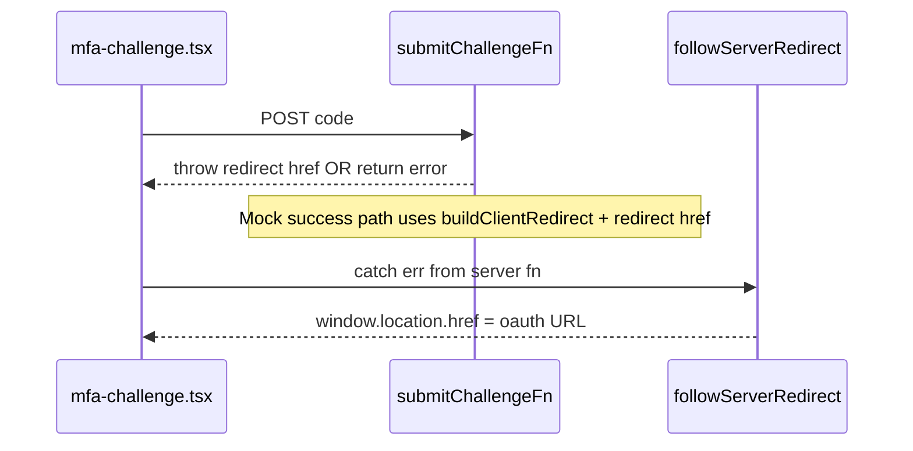

# Fix MFA challenge e2e redirect failure

## What the test expects

[`apps/auth/tests/integration/challenges.spec.ts`](apps/auth/tests/integration/challenges.spec.ts) calls `mockClientRedirect`, signs in as `mfa@example.com`, fills `123456`, clicks Verify, then expects:

```ts
await expect(page).toHaveURL(/org\.anedot\.me\/oauth\?code=mock-/);
```

[`mockClientRedirect`](apps/auth/tests/integration/helpers.ts) only stubs network requests to the allowed OAuth origin; it does **not** block `window.location` navigation. So if the URL stays `http://localhost:3208/mfa-challenge`, the app never assigned `window.location.href` to the OAuth URL.

## Data flow (relevant code)



- [`apps/auth/src/routes/mfa-challenge.tsx`](apps/auth/src/routes/mfa-challenge.tsx): on submit, calls `submitChallengeFn({ data: { code } })`; only navigates if `followServerRedirect` catches a TanStack **redirect**.
- [`apps/auth/src/features/auth/server-functions.ts`](apps/auth/src/features/auth/server-functions.ts): mock MFA completion clears challenge fields and `throw redirect({ href: location })` where `location` comes from [`buildClientRedirect`](apps/auth/src/features/auth/redirects.ts).
- [`apps/auth/src/lib/follow-redirect.ts`](apps/auth/src/lib/follow-redirect.ts): uses **`isRedirect(err)` only** (`instanceof Response`). TanStack Start’s client layer normally `parseRedirect`s serialized redirects before rethrowing ([`createServerFn.ts` in `@tanstack/start-client-core`](node_modules/@tanstack/start-client-core/src/createServerFn.ts)), but any plain-object redirect shape that slips through would **not** pass `isRedirect`, so navigation never runs.

## Likely failure modes (why URL never changes)

1. **Business error path (most actionable)**  
   `submitChallengeFn` resolves with `{ error: "..." }` instead of throwing redirect — user stays on the page; an error line may appear under the form (test doesn’t assert it).

   - **Non-mock (`isMockAuthEnabled()` false)** + missing `challengeUsername` in session causes Cognito branch to hit:

```456:458:apps/auth/src/features/auth/server-functions.ts
      if (!challengeName || !challengeSession || !challengeUsername) {
        return { error: "No active challenge session." };
      }
```

   The mock MFA sign-in branch sets `challengeName` and `challengeSession` but **does not set `challengeUsername`** (see lines 232–239). That is fine while mock mode stays on for **both** calls, but it’s brittle if mock mode differs between requests or any code assumes Cognito-shaped session.

   - **Mock guard + missing code**: mock branch returns `{ error: "A verification code is required." }` when MFA is expected but `data.code` is falsy ([`server-functions.ts`](apps/auth/src/features/auth/server-functions.ts) ~525–530).

2. **Redirect not applied client-side**  
   If the thrown value is not a `Response` with `options`, [`followServerRedirect`](apps/auth/src/lib/follow-redirect.ts) returns false and never sets `window.location`.

3. **Environment / CI**  
   [`isMockAuthEnabled`](apps/auth/src/lib/env.ts) reads `process.env.VITE_AUTH_MOCK_MODE === "true"`. [`playwright.config.ts`](apps/auth/playwright.config.ts) sets `VITE_AUTH_MOCK_MODE: "true"` on the preview `webServer` and loads [`.env.test`](apps/auth/.env.test). If preview/workerd runtime ever sees mock mode false for server functions while sign-in still reached the mock MFA branch, behavior becomes inconsistent — worth confirming once under the same command that fails.

## Recommended investigation (before or while fixing)

1. Run the failing spec from `apps/auth` with headed/trace (Playwright HTML report already enabled): reproduce once and inspect **trace screenshot / DOM** for an error message under “Verification code”, and **network** response for the server-fn call (serialized JSON vs redirect).
2. Confirm whether the response body is `{ error: "..." }` vs an error serialized as redirect.

## Implementation fixes (apply based on evidence; all are low-risk)

| Priority | Change |
|----------|--------|
| **A** | In [`submitSignInFn`](apps/auth/src/features/auth/server-functions.ts) mock MFA branch (`data.email.includes("mfa")`), add **`challengeUsername: data.email`** alongside `challengeName` / `challengeSession` so transaction session matches the Cognito-shaped MFA session. Removes “No active challenge session.” if anything hits the non-mock submit path incorrectly. |
| **B** | Harden [`followServerRedirect`](apps/auth/src/lib/follow-redirect.ts): import **`parseRedirect`** from `@tanstack/react-router` (same as [`router-core` redirect helpers](node_modules/@tanstack/router-core/src/redirect.ts)) and try **`parseRedirect(err)` first**, then **`isRedirect`**, before assigning `window.location.href`. Aligns with TanStack’s serialized redirect contract (`isSerializedRedirect`). Update any duplicate redirect-follow helpers if they exist (grep `followServerRedirect`). |
| **C** | If traces show mock mode false on server: ensure **`VITE_AUTH_MOCK_MODE`** is present at runtime for the Cloudflare preview worker (e.g. document requirement or add `[vars]` / `wrangler dev` parity in [`wrangler.jsonc`](apps/auth/wrangler.jsonc) **only if** preview is confirmed not receiving env — verify first to avoid unnecessary config churn). |

## Verification

- `mise exec -- pnpm --filter auth e2e --grep "MFA challenge completes"` (or full auth e2e).
- Optionally run `pnpm --filter auth test` / typecheck if touching shared helpers.

## Docs

No doc updates unless behavior or env requirements change ([`apps/auth/README.md`](apps/auth/README.md) already mentions `VITE_AUTH_MOCK_MODE`).
