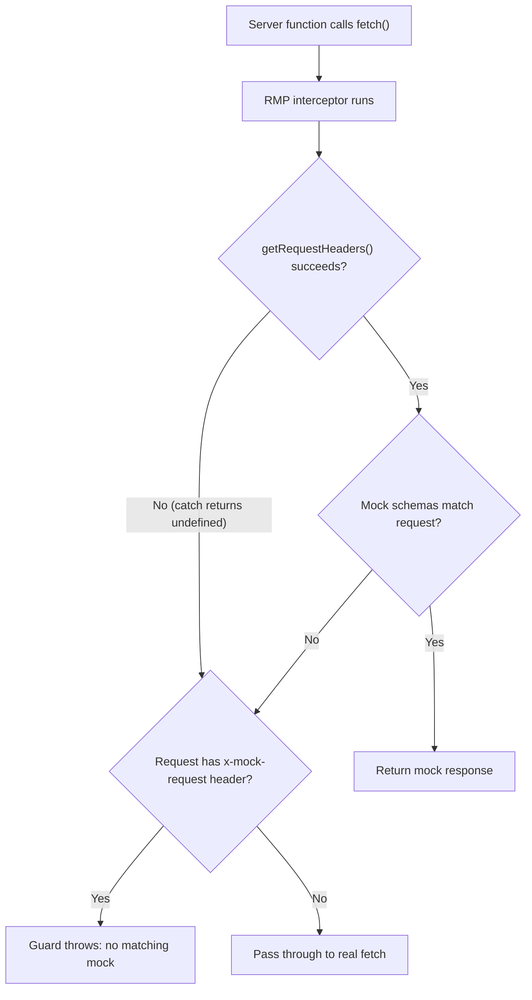

# Fix RMP Mocking for Playwright Tests

## Root Cause

**MSW silently swallows handler errors as 500 responses.** Since MSW v2.3.0 ([PR #2135](https://github.com/mswjs/msw/pull/2135)), any exception thrown inside a handler is converted to a 500 response. The current `createHandler` from RMP registers `http.all('*', ...)` which matches every request. When `getRequestHeaders()` throws (e.g. no TanStack async context available), MSW catches the exception and returns a 500 -- and **never calls `onUnhandledRequest`**.

This explains both symptoms:
- **500 responses**: MSW converts the thrown `getRequestHeaders()` error into a 500 `Response`
- **No `[MSW] Unhandled request:` logs**: `onUnhandledRequest` is only called when no handler matches; since `http.all('*')` matches everything, it's never triggered

## Fix: Replace MSW with `setupFetchInterceptor`

RMP provides two interceptors ([docs](https://github.com/vitalets/request-mocking-protocol?tab=readme-ov-file#interceptors)):

1. **`setupFetchInterceptor`** (recommended) -- directly patches `globalThis.fetch`, 15 lines
2. **`createHandler` + MSW** (fallback) -- for apps that don't use `fetch`

Since the app uses standard `fetch`, we should use option 1. It is simpler and errors propagate normally instead of being silently swallowed.

### Current code ([`packages/test-utils/src/request-mocking.ts`](packages/test-utils/src/request-mocking.ts))

```1:24:packages/test-utils/src/request-mocking.ts
import { getRequestHeaders } from "@tanstack/start-server-core";
import { setupServer } from "msw/node";
import { createHandler } from "request-mocking-protocol/msw";

export function setupRequestMocking() {
  const mockHandler = createHandler(() => {
    return getRequestHeaders();
  });

  // Type mismatch stems from MSW's split type declarations (core vs node). Safe to cast.
  const mswServer = setupServer(
    mockHandler as unknown as Parameters<typeof setupServer>[0],
  );
  mswServer.listen({
    onUnhandledRequest(request) {
      console.error(
        `[MSW] Unhandled request: ${request.method} ${request.url}`,
      );
      throw new Error(
        `[MSW] Unhandled request: ${request.method} ${request.url}`,
      );
    },
  });
}
```

### New code

```typescript
import { getRequestHeaders } from "@tanstack/start-server-core";
import { setupFetchInterceptor } from "request-mocking-protocol/fetch";

const RMP_SETUP = Symbol.for("rmp-fetch-interceptor-setup");
const MOCK_HEADER = "x-mock-request";

export function setupRequestMocking() {
  if ((globalThis as Record<symbol, unknown>)[RMP_SETUP]) return;
  (globalThis as Record<symbol, unknown>)[RMP_SETUP] = true;

  const realFetch = globalThis.fetch;

  // Guard: when RMP can't match a request it falls through to "originalFetch".
  // We replace that fallback so unhandled *test* requests throw a clear error
  // instead of silently hitting the real network.
  globalThis.fetch = ((input: RequestInfo | URL, init?: RequestInit) => {
    const req = new Request(input, init);
    if (req.headers.has(MOCK_HEADER)) {
      throw new Error(
        `[RMP] No matching mock for: ${req.method} ${req.url}\n` +
          "All server-side requests must have a matching mock in tests.",
      );
    }
    return realFetch(input, init);
  }) as typeof fetch;

  // RMP captures the current globalThis.fetch (our guard) as its fallback,
  // then replaces globalThis.fetch with its interceptor.
  setupFetchInterceptor(() => {
    try {
      return getRequestHeaders();
    } catch {
      return undefined;
    }
  });
}
```

### How it works



Key points:
- **`setupFetchInterceptor`** directly patches `globalThis.fetch` -- no MSW layers, no silent 500 conversion
- **Try-catch on `getRequestHeaders()`** handles the case where there is no TanStack request context (e.g. startup fetches, HMR)
- **Guard fetch** sits between RMP and the real network: if the outgoing request carries `x-mock-request` (added by [`forwardRmpMockHeader()`](apps/org-next/src/server/org-api.server.ts)) but RMP didn't match it, the guard throws a clear error. Requests without the header pass through to the real network.
- **`Symbol.for` idempotency guard** prevents double-setup during Vite HMR

### Why `forwardRmpMockHeader` in org-api.server.ts stays

The existing `forwardRmpMockHeader()` copies `x-mock-request` from the incoming browser request onto the outgoing org API fetch. This serves two purposes:
1. Makes the mock header available to the RMP interceptor (it reads from `getRequestHeaders()`, but having it on the outgoing request is a useful invariant)
2. Enables the guard to detect test requests that should have been mocked -- the guard checks `req.headers.has("x-mock-request")`

No changes needed to this file.

### What to verify after the change

1. Run `pnpm exec playwright test` -- all tests should pass
2. Confirm there are **no** 500 responses logged from `org-api.server.ts`
3. Temporarily add an unmocked endpoint call in a test and verify the guard throws a clear `[RMP] No matching mock for:` error
