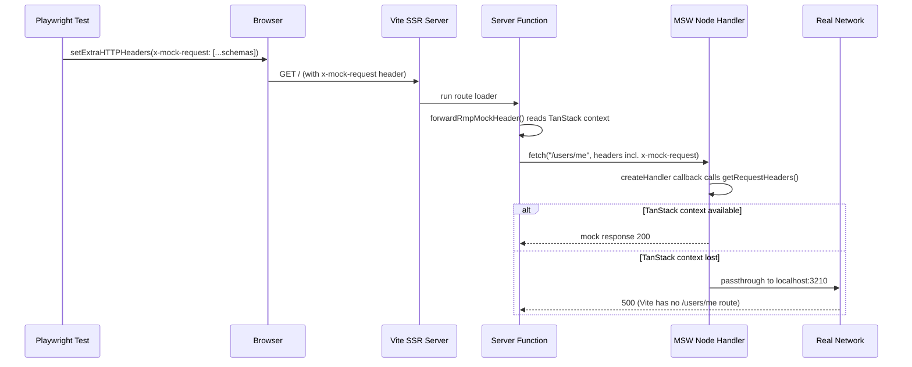

# Fix RMP/MSW Mocking for Playwright Tests

## Problem Analysis

When Playwright tests run, some org API requests (e.g. `GET /users/me`) return **500** from the real Vite server instead of the expected mock response. Tests still pass because the requests that matter for assertions succeed, but extra/redundant requests fail.

### How the mocking chain works



### Root cause

The RMP `createHandler` in [`packages/test-utils/src/request-mocking.ts`](packages/test-utils/src/request-mocking.ts) reads mock schemas exclusively from TanStack's `getRequestHeaders()`:

```6:9:packages/test-utils/src/request-mocking.ts
  const mockHandler = createHandler(() => {
    return getRequestHeaders();
  });
```

When MSW's interceptor runs the handler in a context where TanStack's async context is unavailable (or `getRequestHeaders()` throws), the handler returns `undefined`, MSW passes the request through to the real network, and it hits the Vite dev server at `:3210` which returns 500.

Meanwhile, [`org-api.server.ts`](apps/org-next/src/server/org-api.server.ts) already forwards the `x-mock-request` header onto every outgoing fetch via `forwardRmpMockHeader()` -- but `createHandler`'s callback never reads from the outgoing request, so this forwarded header goes unused.

### Contributing factors

1. **Redundant API calls** -- `getAppBootstrapData()` is called 3 times per homepage load (from `_authed` loader, `getDashboardData`, and `fetchCampaignsList` via `requireBootstrapWithTenant`). Each call makes `/users/me` + `/tenants` fetches, multiplying the surface area for mock failures.
2. **`onUnhandledRequest` throws** -- the current handler throws an `Error`, which can cause unhandled promise rejections even when the passthrough itself is the desired behavior.
3. **No idempotency guard** -- `setupRequestMocking()` can be re-invoked during Vite HMR, potentially creating multiple MSW servers.

## Fix

### 1. Add AsyncLocalStorage fallback to `setupRequestMocking`

File: [`packages/test-utils/src/request-mocking.ts`](packages/test-utils/src/request-mocking.ts)

Wrap `globalThis.fetch` **after** `mswServer.listen()` to store the outgoing request's headers in an `AsyncLocalStorage`. Then modify the `getIncomingHeaders` callback to try `getRequestHeaders()` first, falling back to the stored outgoing headers.

```typescript
import { AsyncLocalStorage } from "node:async_hooks";
import { getRequestHeaders } from "@tanstack/start-server-core";
import { setupServer } from "msw/node";
import { createHandler } from "request-mocking-protocol/msw";

const SETUP_KEY = Symbol.for("rmp-msw-setup");
const outgoingHeadersStore = new AsyncLocalStorage<Headers>();

export function setupRequestMocking() {
  if ((globalThis as Record<symbol, unknown>)[SETUP_KEY]) return;
  (globalThis as Record<symbol, unknown>)[SETUP_KEY] = true;

  const MOCK_HEADER = "x-mock-request";

  const mockHandler = createHandler(() => {
    try {
      const incoming = getRequestHeaders();
      if (incoming?.get(MOCK_HEADER)) return incoming;
    } catch {}

    const outgoing = outgoingHeadersStore.getStore();
    if (outgoing?.get(MOCK_HEADER)) return outgoing;

    return undefined;
  });

  const mswServer = setupServer(
    mockHandler as Parameters<typeof setupServer>[0],
  );
  mswServer.listen({
    onUnhandledRequest(request) {
      console.warn(`[MSW] Unhandled: ${request.method} ${request.url}`);
    },
  });

  // Wrap fetch AFTER MSW patches it so our wrapper runs first
  const interceptedFetch = globalThis.fetch;
  globalThis.fetch = ((input: RequestInfo | URL, init?: RequestInit) => {
    let headers: Headers;
    if (input instanceof Request) {
      headers = new Headers(input.headers);
      if (init?.headers) {
        for (const [k, v] of new Headers(init.headers)) {
          headers.set(k, v);
        }
      }
    } else {
      headers = new Headers(init?.headers);
    }
    return outgoingHeadersStore.run(headers, () =>
      interceptedFetch.call(globalThis, input, init),
    );
  }) as typeof fetch;
}
```

**Why this works**: The `outgoingHeadersStore.run()` establishes an AsyncLocalStorage context that wraps the entire MSW interception. Inside the MSW handler, `outgoingHeadersStore.getStore()` returns the outgoing request's headers -- which include `x-mock-request` thanks to `forwardRmpMockHeader()`. This is reliable regardless of whether TanStack's request context survives the MSW interception boundary.

### 2. Reduce redundant bootstrap calls

Files:
- [`src/server/dashboard.ts`](apps/org-next/src/server/dashboard.ts)
- [`src/server/campaigns.ts`](apps/org-next/src/server/campaigns.ts)

Currently `getDashboardData` calls `getAppBootstrapData()` and then `fetchCampaignsList()` calls it again internally. Refactor so:
- `fetchCampaignsList` accepts a `tenant` parameter instead of calling `requireBootstrapWithTenant()`
- `getDashboardData` passes the already-resolved tenant down

This eliminates 2 redundant `/users/me` + `/tenants` round trips (6 fetches down to 2 + 1 campaigns fetch).

### 3. Verify and run tests

Run Playwright tests to confirm the 500 errors disappear and all tests still pass.
