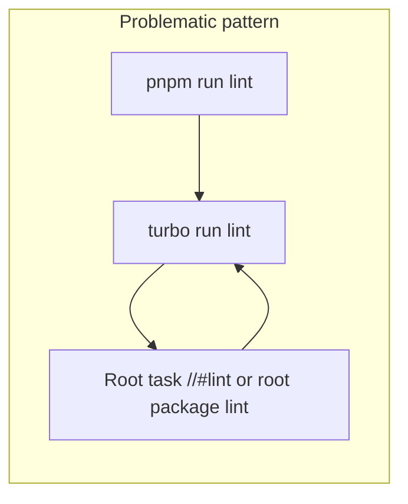

# Diagnose recursive `turbo` on `pnpm run lint`

## What is actually happening

1. **pnpm treats the repo root as a workspace package**  
   `pnpm list -r` shows `@workspace/monorepo` at [`/Users/duhl/git/ui`](package.json) alongside `apps/*` and `packages/*`. So the root is not “outside” the workspace; it is a first-class package.

2. **Root `lint` is `turbo run lint`**  
   In [`package.json`](package.json) (line 17), `lint` is `turbo run lint`. That is the normal **orchestrator** entry for developers.

3. **Turborepo 2.x “Root tasks” create a second link to the same script**  
   If [`turbo.json`](turbo.json) contains tasks named with the `//` root package prefix—e.g. `"//#lint": { ... }` and `"//#lint:fix": { ... }`—Turborepo treats `lint` as a **root task** bound to the root `package.json` `lint` script.  
   Then: `turbo run lint` → runs **root** `lint` → that script is again `turbo run lint` → **recursive turbo invocations**.  

   The CLI error you saw matches this exactly (it cited **Root Task `//#lint`** and [`package.json:17`](package.json)).

4. **Why the docs mention “single-package workspace”**  
   The [recursive invocations doc](https://turborepo.dev/docs/messages/recursive-turbo-invocations) describes the **same loop mechanism**: a script whose **name matches the task** and **calls `turbo`** for that task. In a true single-package repo, that is always a loop. In a monorepo, the **same loop appears when the root package participates as that task**—especially via **explicit `//#lint` root tasks**—not because Turbo skipped your apps.

5. **“Workspace misconfiguration” in that doc**  
   That section is a **separate** cause: missing/invalid `pnpm-workspace.yaml` (or wrong `workspaces` for npm) can make Turbo see **one** package, which again triggers the same pattern. Your [`pnpm-workspace.yaml`](pnpm-workspace.yaml) is present and lists `apps/*` and `packages/*`, so this is **less likely** unless commands are run from the wrong directory or a copy of the repo without that file.

## What to fix (pick one coherent approach)

**Option A — Remove root task entries for lint (simplest if you do not need root-specific lint cache keys)**  
- Delete `"//#lint"` and `"//#lint:fix"` from [`turbo.json`](turbo.json) if they are still there on the branch that fails (your live error referenced them).  
- After removal, confirm `pnpm run lint` works. If anything still loops, use Option B as well.

**Option B — Exclude the root package from the `lint` task graph**  
- Keep `pnpm run lint` as the developer entrypoint but prevent Turbo from scheduling **`@workspace/monorepo`’s** `lint` as a **worker** task, e.g. orchestrate with a filter such as `turbo run lint --filter=!@workspace/monorepo` (exact filter syntax per Turbo docs for your version).  
- This addresses the case where the root package **must not** run `turbo run lint` as one of the parallel package tasks.

**Option C — Rename the orchestrator script (per Turborepo’s doc)**  
- e.g. keep monorepo orchestration as `lint:repo` or `lint:all` and avoid having the root `lint` script both **be** the task Turbo runs for `//` and **call** `turbo` for the same task name.

## Optional: define `lint` in `turbo.json` for caching

Your current [`turbo.json`](turbo.json) on disk has no `lint` task block under `tasks` (only `build`, `clean`, `dev`, `test`, `e2e`, `typecheck`). Adding a `lint` task (outputs/inputs as appropriate for Biome) is optional hygiene once recursion is fixed.

## Verify after changes

- From repo root: `pnpm exec turbo run lint --dry-run` (or equivalent) should show only **leaf** packages running `biome lint`, not the root re-invoking `turbo` in a loop.

