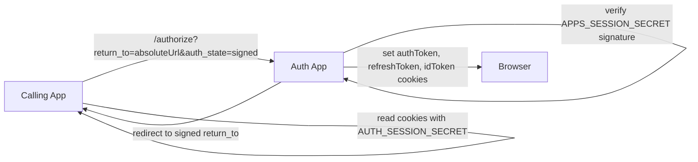

# Generic App-Mode Auth Plan

## Decisions Confirmed
- Apply the new behavior in all environments, not only local development.
- Remove `app` from caller URLs and auth-state payloads entirely.
- Use absolute `return_to` URLs signed by `auth_state`; auth verifies the HMAC before redirecting.
- Require a signed state on logout too, so removing `AUTH_APPS` does not introduce an open redirect.
- Auth uses `APPS_SESSION_SECRET`; callers use the same value as `AUTH_SESSION_SECRET`.

## Current Shape
The registry dependency is concentrated in [`apps/auth/src/lib/app-integration.ts`](/Users/duhl/git/ui/apps/auth/src/lib/app-integration.ts) and used by [`apps/auth/src/features/auth/server-functions.ts`](/Users/duhl/git/ui/apps/auth/src/features/auth/server-functions.ts) for authorize, logout, active transaction recovery, app token cookies, and refresh. The callers currently build `/authorize?app=<slug>&return_to=<relative>&auth_state=<signed>` in [`apps/org-next/src/server/auth-state.ts`](/Users/duhl/git/ui/apps/org-next/src/server/auth-state.ts) and [`apps/virtual-terminal/src/server/auth-state.ts`](/Users/duhl/git/ui/apps/virtual-terminal/src/server/auth-state.ts).

## Target Contract

## Implementation Plan
1. Refactor auth app-mode primitives in [`apps/auth/src/lib/app-integration.ts`](/Users/duhl/git/ui/apps/auth/src/lib/app-integration.ts):
   - Replace registry resolution with a generic app-mode config derived from `APPS_SESSION_SECRET`, fixed cookie names (`authToken`, `refreshToken`, `idToken`), and a global cookie domain strategy.
   - Replace slug-based `AuthStatePayload` with a payload containing `returnTo`, `nonce`, `iat`, and a purpose such as `authorize` or `logout`.
   - Validate `return_to` as an absolute `http:`/`https:` URL and require it to exactly match the signed payload value.
   - Remove `AUTH_APPS` parsing/debug behavior and tests once no call site uses it.

2. Update auth server functions in [`apps/auth/src/features/auth/server-functions.ts`](/Users/duhl/git/ui/apps/auth/src/features/auth/server-functions.ts):
   - Change app-mode authorize detection to `auth_state + return_to`, not `app`.
   - Verify authorize state before any redirect and redirect directly to the verified absolute `return_to`.
   - Store the verified absolute `returnTo` in the transaction session so post-sign-in redirects do not need app lookup.
   - Change logout to require signed logout state before accepting an absolute `return_to`.
   - Change app refresh from `{ app }` input to generic/no app input, since cookie names and secret are now global.

3. Update caller URL builders in [`apps/org-next/src/server/auth-state.ts`](/Users/duhl/git/ui/apps/org-next/src/server/auth-state.ts) and [`apps/virtual-terminal/src/server/auth-state.ts`](/Users/duhl/git/ui/apps/virtual-terminal/src/server/auth-state.ts):
   - Build absolute return URLs from the caller origin plus the existing safe relative path.
   - Stop adding `app` to authorize/logout URLs.
   - Sign both login and logout return targets with `AUTH_SESSION_SECRET` and include the appropriate purpose in the payload.
   - Keep relative-path sanitization at the app boundary so internal callers still pass `/dashboard` or `/login?logged_out=1`.

4. Align environment files and docs:
   - Remove `AUTH_APPS`, `ORG_NEXT_SESSION_SECRET`, and `VIRTUAL_TERMINAL_SESSION_SECRET` requirements from auth docs/templates/tests.
   - Standardize auth env docs/templates on `APPS_SESSION_SECRET`.
   - Standardize caller env docs/templates on `AUTH_SESSION_SECRET` and make local templates point `VITE_AUTH_APP_URL` at `http://localhost:3208` where appropriate.
   - Update [`apps/auth/docs/app-integration.md`](/Users/duhl/git/ui/apps/auth/docs/app-integration.md), [`apps/org-next/docs/README.md`](/Users/duhl/git/ui/apps/org-next/docs/README.md), and [`apps/virtual-terminal/docs/README.md`](/Users/duhl/git/ui/apps/virtual-terminal/docs/README.md) to describe the generic signed-return contract.

5. Update tests:
   - Replace registry unit tests with generic config/signature/absolute-return tests in auth.
   - Update authorize/logout integration tests to assert no `app` parameter is required and unsigned/tampered absolute returns are rejected.
   - Update org-next and virtual-terminal auth-state tests to assert absolute signed `return_to`, no `app`, and signed logout state.
   - Keep cookie contract tests proving `authToken`, `refreshToken`, `idToken`, and the shared secret still match across auth and callers.

## Verification
- Run `pnpm --filter auth test` and `pnpm --filter auth typecheck`.
- Run `pnpm --filter org-next test` and `pnpm --filter org-next typecheck`.
- Run `pnpm --filter virtual-terminal test` and `pnpm --filter virtual-terminal typecheck`.
- Run auth app-mode Playwright coverage with `pnpm --filter auth e2e` if the local auth test environment is available.

## Risk Notes
- Removing `AUTH_APPS` means the shared secret becomes the only app-mode redirect authority, so signed logout state and purpose-specific state are necessary.
- Production app cookies need a generic cookie-domain rule after per-app `cookieDomain` is removed; the implementation should reuse the existing auth cookie domain behavior unless we find a separate deployed requirement during implementation.