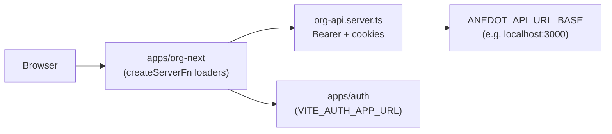
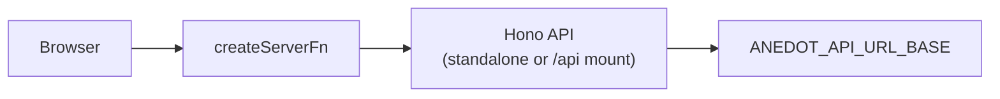

# Where to put a Hono API for org-next

## How org-next talks to backends today

Org-next already has a **BFF layer** inside the TanStack Start app:



- Server-only HTTP to the legacy org API: [`apps/org-next/src/server/org-api.server.ts`](apps/org-next/src/server/org-api.server.ts) via `ANEDOT_API_URL_BASE` (see [`apps/org-next/src/env.ts`](apps/org-next/src/env.ts)).
- Auth is a **separate app** under [`apps/auth`](apps/auth), started alongside org-next in [`scripts/dev.sh`](scripts/dev.sh) (ports ~3208 / 3210).
- Workspace layout is fixed in [`pnpm-workspace.yaml`](pnpm-workspace.yaml): **`apps/*`** = deployables, **`packages/*`** = shared libraries.

A new Hono API is an extra box in that diagram — either **inside** the org-next Nitro process or **beside** it as its own app.

---

## Option A: Standalone service — `apps/<name>/`

**Layout**

| Piece | Location |
|-------|----------|
| Hono app entry, routes, middleware | [`apps/org-api/`](apps/org-api/) (name is yours: `org-bff`, `org-api`, etc.) |
| Shared Zod types / route contracts (optional) | [`packages/org-api/`](packages/org-api/) or extend [`packages/shared-types`](packages/shared-types) if truly cross-app |
| org-next consumer | New env var (e.g. `ORG_BFF_URL`) or repoint `ANEDOT_API_URL_BASE` for local-only paths; call from `createServerFn` with `fetch` (same pattern as `org-api.server.ts`) |
| Local dev | Add `--filter="<name>"` to [`scripts/dev.sh`](scripts/dev.sh); pick an unused port in the 32xx range (org-next = 3210, auth = 3208, virtual-terminal = 3211) |

**What it means**

- **Separate process** in dev and prod (like auth).
- org-next always reaches it over **HTTP** (server-side `fetch` from `createServerFn`, not direct imports of route handlers).
- You can scale, deploy, and version the API independently of the UI.
- Other apps (`virtual-terminal`, future consumers) can share the same service without depending on org-next’s bundle.

**When to choose this**

- The API will grow beyond a thin adapter (many routes, background work, webhooks).
- More than one app will call it.
- You want contract tests / OpenAPI / MSW against a stable base URL.
- You want to avoid coupling Hono’s runtime to TanStack Start / Nitro release cadence.

**Repo precedent:** [`apps/auth`](apps/auth) is the model — not org-next code, but consumed by org-next via URL + cookies/secrets.

---

## Option B: Colocated BFF — inside `apps/org-next`

**Layout**

| Piece | Location |
|-------|----------|
| Hono `app` + routes | e.g. [`apps/org-next/src/server/api/`](apps/org-next/src/server/api/) (`routes.ts`, `index.ts`) |
| Mount into Nitro | [`apps/org-next/vite.config.ts`](apps/org-next/vite.config.ts) — Nitro route/handler hook (Hono’s `fetch` handler or `@hono/node-server` adapter wired into Nitro) |
| org-next consumer | `createServerFn` handlers call **relative** `/api/...` on the same origin, or import handlers only from server-only modules (never from client/routes) |

**What it means**

- **One deployment** — UI + API ship together; no extra port in `pnpm dev` unless you want one for clarity.
- Simpler local story (no second service in `dev.sh`).
- **Tighter coupling:** API changes ride org-next releases; harder for other apps to reuse without importing org-next.
- You must respect existing rules: **no server-only imports in route files** — keep Hono behind `createServerFn` / `.server.ts` ([`apps/org-next/AGENTS.md`](apps/org-next/AGENTS.md), root [`AGENTS.md`](AGENTS.md)).
- Nitro + TanStack Start already own the server; mounting Hono is doable but is **integration work** (not a pattern used elsewhere in this repo yet).

**When to choose this**

- API exists only to serve org-next (true BFF: aggregate/transform the Rails API, hide secrets).
- Small surface area; you do not need a separate deployable.
- You are fine extending the current `createServerFn` → `fetch` model rather than exposing REST to the browser.

**Repo precedent:** Today’s BFF is **`createServerFn` + `org-api.server.ts`**, not REST inside org-next. Hono colocated would **replace or sit next to** that layer, not replace auth.

---

## Side-by-side implications

| | **Standalone `apps/*`** | **Colocated in org-next** |
|--|-------------------------|---------------------------|
| **Dev** | Second service in turbo `dev`; new port + env | Single `vite dev` on 3210 |
| **org-next calls** | `fetch(`${ORG_BFF_URL}/...`)` from server fns | Same-origin `/api/*` or direct server-only imports |
| **Shared types** | `packages/*` workspace dep in both | Can live in `src/` or `packages/*` |
| **Multi-app reuse** | Easy | Awkward |
| **Fits existing patterns** | Strong (mirrors `auth`) | Extends current BFF, new Nitro wiring |
| **Risk** | Ops overhead (two deployables) | Server/client boundary mistakes; Nitro upgrade coupling |

---

## Recommended default for this repo

**Prefer `apps/<service-name>/` (standalone)** unless you are certain the API is org-next-only and will stay small.

Reasons aligned with this codebase:

1. **Auth is already a separate app** — the monorepo treats cross-cutting server capabilities as `apps/*`, not packages.
2. **org-next’s contract to backends is already URL-based** (`ANEDOT_API_URL_BASE`, `VITE_AUTH_APP_URL`) — adding `ORG_BFF_URL` (or similar) is consistent.
3. **No existing Nitro+Hono mount** — standalone Hono (`@hono/node-server` or `hono/node`) is a clean greenfield; colocated requires custom Nitro config and more care on upgrades (org-next pins `nitro-nightly`).

If you split standalone + shared code:

```text
apps/org-api/          # hono serve, port e.g. 3212, turbo dev/build/test
packages/org-api/      # optional: routes, schemas, typed client — imported by app + org-next server code
apps/org-next/         # createServerFn → fetch(ORG_BFF_URL); env in src/env.ts
```

Do **not** put the runnable server only in `packages/*` — packages here are libraries ([`packages/utils`](packages/utils), [`packages/ui-next`](packages/ui-next)), not deployables.

---

## What not to do

- **Don’t put Hono routes in `src/routes/`** — those are TanStack Router pages; server logic belongs in `src/server/` or a separate app.
- **Don’t import Hono handlers from client-visible code** — same import-protection rules as `.server.ts` files.
- **Don’t assume `localhost:3000` is in this repo** — that is the external Rails/OpenAPI backend ([`apps/org-next/AGENTS.md`](apps/org-next/AGENTS.md) points at `../anedot_next`). Your Hono service would typically sit **between** org-next and that API, or replace a subset of calls.

---

## Wiring org-next to either option (same either way)

Keep the browser calling **`createServerFn`**, not Hono directly from the client (matches current security model: cookies/tokens stay server-side).



Update [`apps/org-next/src/env.ts`](apps/org-next/src/env.ts) with the new base URL; optionally document in [`apps/org-next/docs/README.md`](apps/org-next/docs/README.md) when behavior is non-obvious.

---

## Optional follow-up

Once you pick standalone vs colocated, a concrete scaffold plan can cover: package name, port, `turbo.json` tasks, `pnpm-workspace` entry, `dev.sh` filter, and whether Hono proxies the existing org API or owns new endpoints.
