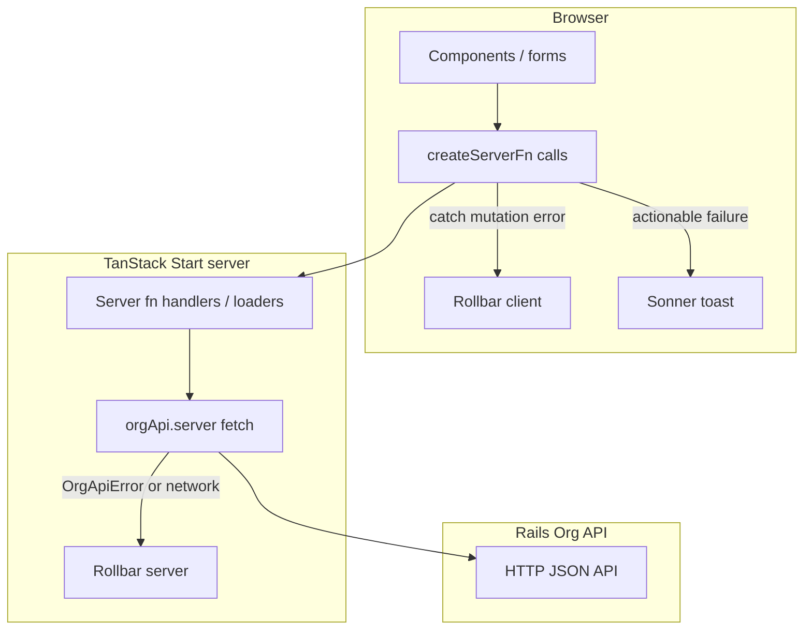

# Error handling: Rollbar + Sonner (org-next)

## File naming (org-next)

Use **camelCase** basenames for TypeScript/TSX files (not kebab-case). Keep required **dot suffixes** as in [AGENTS.md](apps/org-next/AGENTS.md) (e.g. `.server.ts`, `.functions.ts`). Examples: `rollbarServer.server.ts`, `orgApi.server.ts`, `createCampaignModal.tsx`, `rootError.tsx`. When this work touches existing kebab-named files, **rename them** to camelCase in the same change set and update imports so the tree stays consistent.

## Reference patterns in this monorepo

- **Client Rollbar** (Vite): [`apps/donor/src/lib/rollbar.ts`](apps/donor/src/lib/rollbar.ts) — `isRollbarEnabled` from `import.meta.env.PROD && VITE_ROLLBAR_ACCESS_TOKEN`, `logErrorToRollbar`, `logApiErrorToRollbar` with payload truncation.
- **React hook** (optional reuse): [`apps/donor/src/lib/use-rollbar-error-handler.ts`](apps/donor/src/lib/use-rollbar-error-handler.ts) (donor uses kebab-case; in org-next prefer **`useRollbarErrorHandler.ts`** if you add a hook) — thin wrappers around those helpers.
- **Error boundary logging**: [`apps/donor/src/components/error-boundary.tsx`](apps/donor/src/components/error-boundary.tsx) logs to Rollbar when the boundary fires.
- **Sonner**: [`packages/ui/src/components/ui/sonner.tsx`](packages/ui/src/components/ui/sonner.tsx) exports `Toaster`; [`apps/donor/src/routes/__root.tsx`](apps/donor/src/routes/__root.tsx) mounts `<Toaster position="top-right" richColors />` beside `<Outlet />`. [`apps/auth/src/routes/__root.tsx`](apps/auth/src/routes/__root.tsx) uses `import { Toaster } from "sonner"` directly — either approach is fine; **align org-next with donor** (`@workspace/ui` + same placement) for consistency.

**Dependency**: add [`rollbar`](https://www.npmjs.com/package/rollbar) to [`apps/org-next/package.json`](apps/org-next/package.json) (donor uses `^2.26.5`). org-next already lists [`sonner`](apps/org-next/package.json) but does not render a `<Toaster />` yet.

## Layered model (what logs where, what the user sees)

- **Server → Rails** ([`apps/org-next/src/server/orgApi.server.ts`](apps/org-next/src/server/orgApi.server.ts)): Every non-OK response and **network/parse failures** around `fetch` should **log to server Rollbar** with safe context (`path`, `method`, `status`, truncated body). Still **throw `OrgApiError`** (or rethrow) so behavior stays the same for callers.
- **Browser → TanStack server**: When a `createServerFn` call **rejects** on the client (mutations in [`createCampaignModal.tsx`](apps/org-next/src/components/createCampaignModal.tsx), [`$campaignId.tsx`](apps/org-next/src/routes/_authed/campaigns/$campaignId.tsx), [`workspace/new.tsx`](apps/org-next/src/routes/_authed/workspace/new.tsx)), **log to client Rollbar** with a stable tag (e.g. `serverFn`, handler name). **Toast** only where the user can act (retry, fix input) — see table below.
- **Loaders / route errors**: Today, failures bubble to [`apps/org-next/src/components/rootError.tsx`](apps/org-next/src/components/rootError.tsx) via `errorComponent`. **Do not add a toast** for the same failure (avoids duplicate UX). **Do log once**: prefer **`useEffect` in `RootError`** (or an error-boundary-style wrapper) calling **client Rollbar** when the error UI mounts, so loader/navigation failures are still reported. For **SSR-rendered errors**, rely on **server-side logging** in the server path that failed (especially [`orgApi.server.ts`](apps/org-next/src/server/orgApi.server.ts) and server fn handlers), since `RootError` may only run on the client for some cases.

**Server Rollbar**: Donor’s setup is browser-centric. For Nitro/TanStack Start, add [`apps/org-next/src/server/rollbarServer.server.ts`](apps/org-next/src/server/rollbarServer.server.ts) using Rollbar’s **Node/server access token** (separate from the browser token — document both in [`.env.template`](apps/org-next/.env.template): `VITE_ROLLBAR_ACCESS_TOKEN` + `ROLLBAR_SERVER_ACCESS_TOKEN` or the name your team standardizes). Gate with `process.env.NODE_ENV === "production"` and presence of the token, mirroring donor’s dev console fallback.

## Pinpoint: current throws/catches and what to do

| Location | What happens today | Rollbar | User (Sonner / UI) |
|----------|---------------------|---------|---------------------|
| [`orgApi.server.ts`](apps/org-next/src/server/orgApi.server.ts) | `OrgApiError` on 401 token, `!response.ok`, implicit fetch failures | **Server**: log all non-401 failures + network errors with context | N/A (server) |
| [`appBootstrap.ts`](apps/org-next/src/server/appBootstrap.ts) | `fetchCurrentUser` swallows 404; rethrows other errors; `fetchAccessibleTenants` returns `[]` on non-401 | Log when rethrowing; consider logging **empty tenant list** due to unexpected errors only if you distinguish 401 vs other (today 401 rethrows, others return `[]` — **that `[]` path may hide API bugs**; optional follow-up: log at `warn` when status not 401/403) | Loader failure → **RootError** only |
| [`authSession.ts`](apps/org-next/src/server/authSession.ts) | `refreshTokensWithRefreshToken` throws on Cognito failure; outer catch clears session and returns `null` **silently** | **Server**: log refresh failure before clearing session (high signal for auth outages) | User sees “logged out” behavior — **no toast** unless product wants a specific message |
| [`campaigns.functions.ts`](apps/org-next/src/server/campaigns.functions.ts) | Catches `OrgApiError` 401 → redirect; otherwise rethrows; generic `Error` when campaign null | **Server**: after 401 branch, log then rethrow; include `operation` in custom data | Client shows below |
| [`tenants.functions.ts`](apps/org-next/src/server/tenants.functions.ts) | Pass-through to `createTenant` | Covered by `orgApi` + handler wrapper | Client shows below |
| [`_authed.tsx`](apps/org-next/src/routes/_authed.tsx), [`_authed/index.tsx`](apps/org-next/src/routes/_authed/index.tsx), [`workspace/new.tsx`](apps/org-next/src/routes/_authed/workspace/new.tsx) loader | 401 → login redirect; else rethrow | Server log via failing `getOrgApiJson` / bootstrap; **RootError** logs on client | **RootError** — no toast |
| [`createCampaignModal.tsx`](apps/org-next/src/components/createCampaignModal.tsx) | `catch` sets inline form error only | **Client** log | **Toast** + keep short inline error (or toast only — pick one pattern for a11y) |
| [`$campaignId.tsx`](apps/org-next/src/routes/_authed/campaigns/$campaignId.tsx) `handleSave` | `catch` sets `saveError` string | **Client** log | **Toast** for “Couldn’t save” (actionable: retry) + optional inline |
| [`workspace/new.tsx`](apps/org-next/src/routes/_authed/workspace/new.tsx) `onSubmit` | `catch` sets `formError` | **Client** log | **Toast** + existing inline |
| [`RootError`](apps/org-next/src/components/rootError.tsx) | Renders friendly copy | **Client** log in `useEffect` | Already full-page — **no toast** |
| [`env.server.ts`](apps/org-next/src/server/env.server.ts), tests, mocks | Config/test throws | No Rollbar (dev/test) | N/A |

**401 / redirect**: Do **not** spam Rollbar for expected unauthenticated flows; **do** log **server** if refresh/token resolution fails in ways that indicate misconfiguration (optional `warn` level).

**User-facing copy**: Keep messages **short and actionable** (“Couldn’t save changes. Try again.”) — avoid raw JSON or Rails stack traces in toasts ( [`RootError.describeError`](apps/org-next/src/components/rootError.tsx) already tries to tame JSON-like messages for the full page).

## Implementation sketch (after plan approval)

1. Add Rollbar helpers under `apps/org-next/src/lib/rollbar.ts` (copy/adapt donor) + `apps/org-next/src/server/rollbarServer.server.ts` for Node.
2. Instrument [`orgApi.server.ts`](apps/org-next/src/server/orgApi.server.ts): wrap `fetch`, log on failure, then throw `OrgApiError` as today (includes renaming `org-api.server.ts` → `orgApi.server.ts` if not done yet).
3. Mount `<Toaster />` in [`apps/org-next/src/routes/__root.tsx`](apps/org-next/src/routes/__root.tsx) `RootDocument` (next to `<Outlet />`), matching donor.
4. Add a tiny **`reportClientError(error, context)`** used from mutation `catch` blocks (and optionally from a shared hook) that calls `logErrorToRollbar` and returns a **boolean** or **enum** for whether to toast (e.g. skip toast for 401 if it ever surfaces as redirect failure).
5. **`RootError`**: `useEffect` → `logErrorToRollbar` once per error.
6. Update **`.env.template`** and deployment docs with Rollbar vars (no secrets in repo).

## Testing

- **Vitest**: mock Rollbar in tests (no network); assert handlers still throw/redirect.
- **Playwright**: existing flows should still pass; optional assertion that toast region exists on mutation failure if you add a `data-testid` on the toaster or toast copy.
