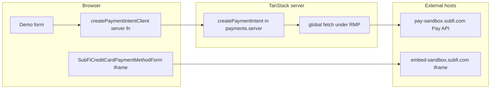

# Playwright testing for `demo.tsx` without external SubFi calls

## What the page actually does

- **Server path**: [`createPaymentIntent`](apps/org-next/src/server/payments.server.ts) uses `@subfico/pay-js-sdk/api` (`createPayApiClient`) against `env.SUB_API_URL_BASE` (see [`.env.e2e`](apps/org-next/.env.e2e): `https://pay-sandbox.subfi.com`), with `POST /customers` and `POST /payment_intents` (and possibly `GET /customers` on the 422 retry path in `findOrCreateCustomer`).
- **Client path**: [`SubFiCreditCardPaymentMethodForm`](apps/org-next/src/routes/_authed/campaigns/$campaignId/pages/demo.tsx) loads an iframe whose `src` is built from `getEmbedOrigin(renderToken)` — for sandbox tokens that is **`https://embed-sandbox.subfi.com`** (see `node_modules/@subfico/pay-js-sdk/src/react.tsx`), not the Pay API host.

## How this interacts with existing e2e infrastructure

1. **Request mocking (RMP)** — [docs](apps/org-next/docs/README.md): With `VITE_ENABLE_RMP=true`, [`setupRequestMocking`](packages/test-utils/src/request-mocking.ts) wraps **global `fetch`** on the server. Playwright’s `mockServerRequest` sets `x-mock-request` on the browser context; that context is intended to reach server-side `fetch` during server-function execution so **SubFi Pay API calls can be stubbed the same way as Org API** — provided you register matching handlers for the **full URLs** your tests will hit (derive patterns from `SUB_API_URL_BASE` like [`getMockApiUrls`](apps/org-next/tests/get-mock-api-urls.ts) does for `ANEDOT_API_URL_BASE`).
2. **Org API still required for navigation** — [`/_authed` loader](apps/org-next/src/routes/_authed.tsx) runs [`getAppBootstrapData`](apps/org-next/src/server/app-bootstrap.ts) (`GET /users/me`, `GET /tenants`). Tests should mirror other specs (e.g. [`campaigns.spec.ts`](apps/org-next/tests/campaigns.spec.ts)): mock those before `page.goto("/campaigns/101/pages/demo")` (or equivalent).
3. **Browser external blocking** — [`tests/test-fixture.ts`](apps/org-next/tests/test-fixture.ts) aborts **all non-app-origin** requests. That **includes the embed iframe document** on `embed-sandbox.subfi.com`, so the iframe will not load a real SubFi UI unless you change routing for that test. This is separate from RMP (which does not run in the browser for those URLs).

## Practical approaches (ideas)

### A. Shallow route / “page boots” test (least coupling)

- Mock Org API + navigate to `/campaigns/:id/pages/demo`.
- Assert static UI: email field, Pay button, presence of the iframe element (or accessible region if the SDK exposes one).
- **Does not** submit the form, **does not** verify payment success. No SubFi Pay API mocks needed if you never call `createPaymentIntentClient`.
- **Caveat**: You still “avoid external” for **Pay API**, but the page **attempts** to load the embed; with the default fixture the navigation is **blocked**, not “silent success”. So you either accept a broken iframe for this test or combine with B/D below.

### B. Stub server-only payment flow (RMP for Pay API)

- Add helpers (e.g. `getMockSubfiApiUrls()` from `env.SUB_API_URL_BASE`) for regexes like `POST .../customers`, `POST .../payment_intents`, and optionally `GET .../customers` with query params.
- Return JSON shapes compatible with the SDK/openapi types: customer with `id`; payment intent create response with a **`token`** field (what [`createPaymentIntent`](apps/org-next/src/server/payments.server.ts) returns). If you ever assert `confirmPaymentIntent`, the token must be a JWT `confirmPaymentIntent` can decode (it reads `payment_intent_id` from the payload per SDK).
- Register mocks **before** `page.goto` and avoid `mockServerRequest.reset()` after load (same flake guidance as in [`organizations-new.spec.ts`](apps/org-next/tests/organizations-new.spec.ts)).

### C. Handle the embed iframe without calling SubFi (browser layer)

Pick one:

- **Selective allowlist + `route.fulfill`**: In a dedicated spec (or override fixture), register `context.route("https://embed-sandbox.subfi.com/**", …)` **before** the global `**/*` handler runs (ordering matters), and fulfill minimal HTML. To make `validateForm` succeed, the stub page would need to implement SubFi’s `postMessage` protocol (`VALIDATE_FORM` / response with matching `requestId`) — see SDK [`validateForm`](node_modules/@subfico/pay-js-sdk/src/react.tsx). This is **accurate but brittle** if the protocol changes.
- **Selective `route.continue()` only**: Would still hit real SubFi — **not** acceptable for “no external service.”

### D. Avoid the iframe in automated UI tests

- **Component/route tests** (Vitest + RTL) with `@subfico/pay-js-sdk/react` mocked or `SubFiCreditCardPaymentMethodForm` replaced by a test double — exercises your form wiring without Playwright.
- **Direct server-fn / `createPaymentIntent` integration test** — mock `fetch` or run with RMP in a Node test harness — validates [`payments.server.ts`](apps/org-next/src/server/payments.server.ts) without the demo route.

### E. Security / maintenance note (out of scope for “ideas” but relevant)

- [`demo.tsx`](apps/org-next/src/routes/_authed/campaigns/$campaignId/pages/demo.tsx) embeds a long-lived **sandbox render JWT** in source. For CI reproducibility and to avoid accidental sandbox coupling, future work might move this to env and use a **test-only** token or fixture — not required to describe isolation strategies, but worth aligning if you add e2e.

## Suggested direction

- **Fast win**: **A** (smoke: loads under mocks) + document that the iframe is blocked by design in the default fixture.
- **Full submit path without Pay API**: **B** + either **C** (stub embed) or accept **D** for anything that needs reliable `validateForm`/confirm behavior without maintaining postMessage stubs.

If you implement new mock URL helpers or change fixture routing for embed hosts, update [`apps/org-next/docs/README.md`](apps/org-next/docs/README.md) (request mocking section) in the same change so future agents know SubFi is mocked like Org API for server `fetch`, while the embed host is a separate browser concern.
