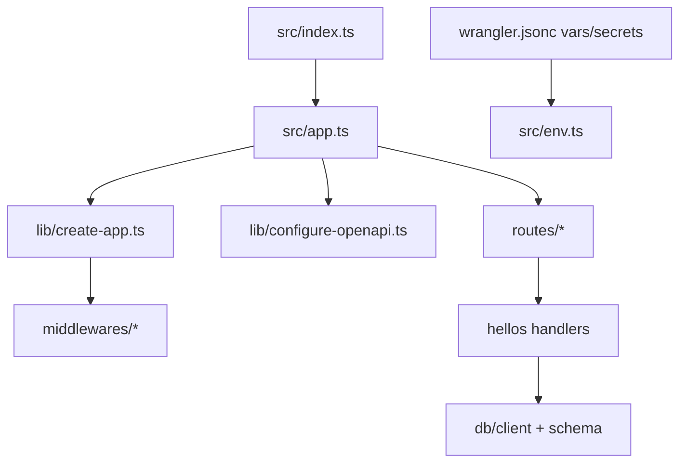

# Port hono-setup-1 into apps/api

## Current state

| | [apps/api](apps/api) | [hono-setup-1](file:///Users/duhl/git/hono-setup-1) |
|---|---|---|
| Entry | Single `Hono` in `src/index.ts` | `index.ts` re-exports `app.ts` |
| Deps | `hono`, `wrangler` only | OpenAPI, Drizzle, Neon, Pino, Stoker, Scalar, Vitest, etc. |
| Config | Minimal `wrangler.jsonc`, loose `tsconfig.json` | Rate limits, vars/secrets, observability, Drizzle, Vitest |
| Structure | 1 file | ~26 `src/` files + middleware + routes + DB |

You chose **full copy** (hellos example + migrations included).

## Target architecture



## 1. Update [apps/api/package.json](apps/api/package.json)

Merge scripts and dependencies from [hono-setup-1/package.json](file:///Users/duhl/git/hono-setup-1/package.json):

**Scripts to add:** `typecheck`, `test`, `test:watch`, `db:generate`, `db:migrate`, `db:studio`, keep `dev` / `deploy` / `cf-typegen` (align `cf-typegen` with hono-setup: `wrangler types`).

**Dependencies to add:**
- `@hono/zod-openapi`, `@neondatabase/serverless`, `@scalar/hono-api-reference`, `drizzle-orm`, `hono-pino`, `pino`, `stoker`, `zod`

**Dev dependencies to add:**
- `@cloudflare/vitest-pool-workers`, `drizzle-kit`, `vitest`
- Use monorepo catalog where available: `typescript: catalog:`, `@types/node: catalog:`
- Bump `wrangler` to `^4.92.0` (matches lockfile resolution)

**Metadata:** add `"version": "0.1.0"` and `"private": true` (required by [configure-openapi.ts](file:///Users/duhl/git/hono-setup-1/src/lib/configure-openapi.ts) which imports `package.json`).

**Do not copy** hono-setup’s local `lint`/`format`/`check` scripts or `biome.json` — the monorepo already uses root [biome.jsonc](biome.jsonc).

Run `pnpm install` from repo root after editing.

## 2. Copy source tree into `apps/api/src/`

Replace the bare `Hono` stub by copying the full `src/` layout from hono-setup-1:

| Path | Purpose |
|------|---------|
| `src/index.ts` | Re-export default app |
| `src/app.ts` | Wire routes + OpenAPI |
| `src/env.ts` | `Bindings` / `AppEnv` types |
| `src/client.ts` | Typed `hc` client factory |
| `src/lib/*` | `create-app`, OpenAPI config, errors, types |
| `src/middlewares/*` | CORS, logging, rate limit, security, errors |
| `src/openapi/default-hook.ts` | Zod validation hook |
| `src/db/*` | Neon Drizzle client + schema |
| `src/routes/*` | Index + hellos CRUD module |

**Monorepo-specific string tweaks** (during copy, not a second pass):

- [configure-openapi.ts](file:///Users/duhl/git/hono-setup-1/src/lib/configure-openapi.ts): title/description → `Anedot API` (or similar)
- [index.route.ts](file:///Users/duhl/git/hono-setup-1/src/routes/index.route.ts): `service` field → `api` (matches wrangler name)
- Default CORS in [cors.ts](file:///Users/duhl/git/hono-setup-1/src/middlewares/cors.ts) fallback: `http://localhost:3209` (prototype dev port in [apps/prototype/package.json](apps/prototype/package.json))

## 3. Wrangler setup (kept and extended)

**Yes — Wrangler stays the deployment model.** We are not switching to Node, Vite, or another host. The existing [apps/api/wrangler.jsonc](apps/api/wrangler.jsonc) scaffold is the base; hono-setup’s Worker bindings are merged in on top.

**Preserved from your current `wrangler.jsonc`:**
- `"name": "api"` (Worker name in Cloudflare)
- `"main": "src/index.ts"` (Worker entry)
- `"compatibility_date": "2026-05-18"` (keep yours, not hono-setup’s `2026-05-15`)
- `$schema` path
- Commented placeholders (`kv_namespaces`, `r2_buckets`, `d1_databases`, `ai`, etc.) — left in place for future use unless you prefer a slimmer file

**Added from hono-setup** (required for middleware/env to work):
- `observability.enabled`
- `vars` — `ENVIRONMENT`, `CORS_ORIGIN`, `LOG_LEVEL`
- `secrets.required` — `DATABASE_URL`
- `ratelimits` — `API_RATE_LIMITER` binding (used by rate-limit middleware)

**Scripts unchanged in spirit:** `pnpm dev` → `wrangler dev`, `pnpm deploy` → `wrangler deploy`, `pnpm cf-typegen` → `wrangler types`. Vitest uses the same `wrangler.jsonc` via `@cloudflare/vitest-pool-workers`.

Local secrets still load from `.dev.vars` (gitignored); copy from `.dev.vars.example` after port.

## 4. Copy other config and database artifacts

| File | Action |
|------|--------|
| [drizzle.config.ts](file:///Users/duhl/git/hono-setup-1/drizzle.config.ts) | Copy as-is |
| [vitest.config.ts](file:///Users/duhl/git/hono-setup-1/vitest.config.ts) | Copy as-is |
| [.dev.vars.example](file:///Users/duhl/git/hono-setup-1/.dev.vars.example) | Copy; set `CORS_ORIGIN=http://localhost:3209` |
| `drizzle/` | Copy `0000_solid_reaper.sql` + `meta/` |

## 4. Update [apps/api/tsconfig.json](apps/api/tsconfig.json)

Replace with hono-setup’s stricter config ([tsconfig.json](file:///Users/duhl/git/hono-setup-1/tsconfig.json)): `noEmit`, `verbatimModuleSyntax`, `types: ["vitest/globals"]`, include `worker-configuration.d.ts`, `vitest.config.ts`, `drizzle.config.ts`.

## 6. Merge [apps/api/.gitignore](apps/api/.gitignore)

Add hono-setup patterns: `.dev.vars`, `.dev.vars.*`, `coverage/`, `.cursor/` (if desired).

## 7. Generate types and verify

From `apps/api`:

```sh
pnpm cf-typegen   # creates worker-configuration.d.ts from wrangler.jsonc
pnpm typecheck
pnpm test
pnpm dev
```

Local secrets: `cp .dev.vars.example .dev.vars` and set a real Neon `DATABASE_URL`, then `pnpm db:migrate` when ready.

## 8. Optional monorepo wiring (recommended, small)

- Add `"typecheck": "tsc --noEmit"` so [turbo.json](turbo.json) `typecheck` task works for `api`
- Add `api` to root `dev` filter in [package.json](package.json) if you want `turbo dev` to start the API alongside prototype/ui-catalog
- Replace [apps/api/README.md](apps/api/README.md) with hono-setup README content, adjusted for `pnpm` + monorepo paths

## Files intentionally skipped

| hono-setup file | Reason |
|-----------------|--------|
| `biome.json` | Root [biome.jsonc](biome.jsonc) already covers `apps/api` |
| `pnpm-lock.yaml` | Monorepo root lockfile |
| `worker-configuration.d.ts` | Regenerated via `cf-typegen` |
| `.wrangler/`, `node_modules/` | Local/dev artifacts |
| `docs/*` | Optional; copy only if you want deployment docs in-repo |

## Dependency summary (delta)

```text
+ @hono/zod-openapi, @neondatabase/serverless, @scalar/hono-api-reference
+ drizzle-orm, hono-pino, pino, stoker, zod
+ @cloudflare/vitest-pool-workers, drizzle-kit, vitest
+ typescript, @types/node (catalog)
~ wrangler ^4.92.0
```

No new pnpm catalog entries required unless you want centralized version pinning later; direct versions in `apps/api/package.json` match how `hono` is declared today.
