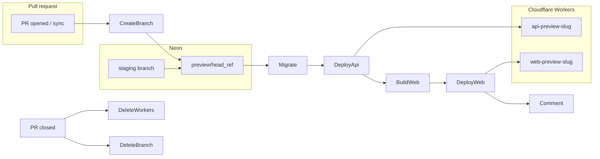

# Preview deployment workflows

## Architecture

Each pull request gets three isolated resources:



**Why dedicated Workers:** You chose per-PR Workers so `DATABASE_URL` and other secrets are not shared on `api-staging` / `web-staging` (Worker secrets are script-level, not per preview version).

**Naming (shared between workflows):** Add [`.github/scripts/preview-names.sh`](.github/scripts/preview-names.sh) that reads `GITHUB_HEAD_REF` and prints (via `$GITHUB_OUTPUT` or stdout):

| Output | Rule | Example (`feature/add-auth`) |
|--------|------|------------------------------|
| `neon_branch` | `preview/${GITHUB_HEAD_REF}` | `preview/feature/add-auth` |
| `cf_slug` | lowercase; non `[a-z0-9-]` → `-`; trim; max ~40 chars; must start with `[a-z]` | `feature-add-auth` |
| `api_worker` | `api-preview-${cf_slug}` | `api-preview-feature-add-auth` |
| `web_worker` | `web-preview-${cf_slug}` | `web-preview-feature-add-auth` |

Enforce Cloudflare preview-alias rules on `cf_slug` (letters, numbers, dashes; starts with letter; combined worker name ≤ 63 chars).

**Predictable URLs (for CORS + build):** Add a repo variable `CLOUDFLARE_WORKERS_DEV_SUBDOMAIN` (account workers.dev subdomain, e.g. from an existing `api-staging` URL). Then:

- API: `https://${api_worker}.${CLOUDFLARE_WORKERS_DEV_SUBDOMAIN}.workers.dev`
- Web: `https://${web_worker}.${CLOUDFLARE_WORKERS_DEV_SUBDOMAIN}.workers.dev`
- API docs: `${API_URL}/reference` ([`apps/api/README.md`](apps/api/README.md))

Update [`DECISION_RECORD.md`](DECISION_RECORD.md) Neon section: preview branches use parent **`staging`** (your spec; doc currently says parent `preview`).

---

## Prerequisites (one-time repo setup)

| Name | Type | Purpose |
|------|------|---------|
| `NEON_API_KEY` | secret | Neon create/delete branch actions |
| `NEON_PROJECT_ID` | variable | Neon project |
| `CLOUDFLARE_API_TOKEN` | secret | Already used in [`deploy.yml`](.github/workflows/deploy.yml) |
| `CLOUDFLARE_ACCOUNT_ID` | secret | Same |
| `CLOUDFLARE_WORKERS_DEV_SUBDOMAIN` | variable | Build predictable `*.workers.dev` URLs |
| `LOGTAIL_SOURCE_TOKEN` | secret | API logging (reuse staging value) |
| `WORKOS_CLIENT_ID` | secret (optional) | Web preview auth; omit if previews are unauthenticated |

Optional: GitHub **environment** `preview` on the deploy job for approval gates / scoped secrets.

---

## 1. [`deploy-preview.yml`](.github/workflows/deploy-preview.yml)

**Triggers:** `pull_request` (`opened`, `synchronize`, `reopened`)

**Permissions:** `contents: read`, `pull-requests: write` (PR comment)

**Concurrency:**

```yaml
group: preview-${{ github.event.pull_request.number }}
cancel-in-progress: true
```

**Job steps (mirror toolchain from [`deploy.yml`](.github/workflows/deploy.yml)):**

1. **Checkout** + pnpm/node setup (Node `25.3.0`, pnpm `10.20.0`, frozen lockfile).
2. **Compute names** — run `preview-names.sh` → `neon_branch`, `cf_slug`, `api_worker`, `web_worker`, `api_url`, `web_url`.
3. **Neon branch** — [`neondatabase/create-branch-action@v6`](https://github.com/neondatabase/create-branch-action):
   - `branch_name: ${{ neon_branch }}`
   - `parent_branch: staging`
   - `project_id: ${{ vars.NEON_PROJECT_ID }}`
   - `api_key: ${{ secrets.NEON_API_KEY }}`
   - Use output `db_url` (pooled) for migrations + API secret.
   - Use output `branch_id` for Neon console link in PR comment.
4. **Migrations** — from `apps/api`:

```yaml
env:
  DATABASE_URL: ${{ steps.create-branch.outputs.db_url }}
run: pnpm --filter api run db:migrate
```

([`drizzle.config.ts`](apps/api/drizzle.config.ts) already requires `DATABASE_URL` for `db:migrate`.)

5. **Deploy API** — dedicated Worker (not `--env staging`):

```bash
# secrets are script-scoped to api_worker
echo "$DATABASE_URL" | pnpm --filter api exec wrangler secret put DATABASE_URL --name "$API_WORKER"
echo "$LOGTAIL_TOKEN" | pnpm --filter api exec wrangler secret put LOGTAIL_SOURCE_TOKEN --name "$API_WORKER"
pnpm --filter api exec wrangler secret put CORS_ORIGIN --name "$API_WORKER" <<< "$WEB_URL"
pnpm --filter api exec wrangler secret put ENVIRONMENT --name "$API_WORKER" <<< "preview"
pnpm --filter api exec wrangler secret put LOG_LEVEL --name "$API_WORKER" <<< "info"
pnpm --filter api run deploy -- --name "$API_WORKER" --minify
```

6. **Build web for preview** — pass API URL at build time:

```yaml
env:
  VITE_API_URL: ${{ env.api_url }}
run: pnpm exec turbo build --filter=web
```

7. **Deploy web** — same pattern as staging deploy, with dynamic name:

```bash
pnpm --filter web exec wrangler deploy --config dist/server/wrangler.json --name "$WEB_WORKER"
```

Optionally set `WORKOS_CLIENT_ID` via `wrangler vars put` on `$WEB_WORKER` if secret is configured.

8. **PR comment** — [`peter-evans/create-or-update-comment@v4`](https://github.com/peter-evans/create-or-update-comment) with a stable `comment-id` (e.g. `preview-deployment`) and body:

- Neon branch: link to `https://console.neon.tech/app/projects/${NEON_PROJECT_ID}/branches/${branch_id}`
- API reference: `${api_url}/reference`
- Frontend: `${web_url}`

Do **not** re-run Biome here; [`ci.yml`](.github/workflows/ci.yml) already gates PRs.

---

## 2. [`cleanup-preview.yml`](.github/workflows/cleanup-preview.yml)

**Triggers:** `pull_request` `types: [closed]`

**Steps:**

1. Checkout + compute names (same `preview-names.sh`).
2. **Delete Cloudflare Workers** (idempotent; ignore missing):

```bash
pnpm --filter api exec wrangler delete "$API_WORKER" --force || true
pnpm --filter web exec wrangler delete "$WEB_WORKER" --force || true
```

3. **Delete Neon branch** — [`neondatabase/delete-branch-action@v3`](https://github.com/neondatabase/delete-branch-action):

```yaml
with:
  project_id: ${{ vars.NEON_PROJECT_ID }}
  branch: ${{ neon_branch }}
  api_key: ${{ secrets.NEON_API_KEY }}
```

4. **Optional:** update/remove the preview PR comment (delete or strikethrough “Preview torn down”).

---

## Small code/config changes (supporting)

### API — allow `ENVIRONMENT=preview`

In [`apps/api/src/env.ts`](apps/api/src/env.ts), extend the enum:

```ts
.enum(["development", "staging", "production", "preview", "test"])
```

Regenerate types if you run `pnpm --filter api cf-typegen` after binding changes.

### Web — build-time API URL

In [`apps/web/src/env.ts`](apps/web/src/env.ts), add client env (used when the app starts calling the API):

```ts
client: {
  VITE_API_URL: z.url(),
},
```

Document in [`apps/web/README.md`](apps/web/README.md) that preview CI sets `VITE_API_URL` at build time.

(No change required to [`apps/api/wrangler.jsonc`](apps/api/wrangler.jsonc) / [`apps/web/wrangler.jsonc`](apps/web/wrangler.jsonc) staging/production envs; preview uses `--name` overrides only.)

---

## Operational notes

- **Re-runs:** `create-branch-action` reuses an existing branch if present; migrations remain safe to re-run.
- **Long branch names:** truncate `cf_slug` so `api-preview-*` stays within Worker/DNS limits.
- **First deploy:** use `wrangler deploy` (not `versions upload`) for net-new preview Workers ([Cloudflare docs](https://developers.cloudflare.com/workers/configuration/versions-and-deployments/)).
- **Security:** never echo `db_url` in logs; pass only to `DATABASE_URL` env / `wrangler secret put` stdin.
- **Manual fallback:** document `neonctl branches delete` and `wrangler delete` with computed names if Actions fail.

---

## Verification checklist

After implementation:

1. Open a test PR → workflow creates Neon branch, migrates, deploys both Workers, comments links.
2. Push to PR → concurrency cancels prior run; new commit redeploys same Workers/branch.
3. Close PR → Workers deleted, Neon branch deleted.
4. Hit `${api_url}/reference` and `${web_url}` from the comment; confirm API uses preview DB (e.g. isolated hello data).
