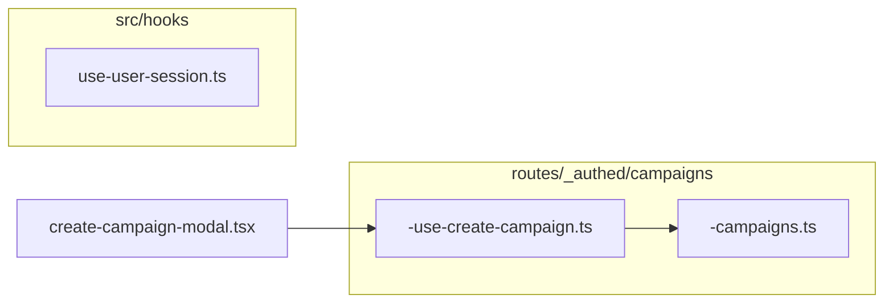

# Reorganize hooks (org-next)

## Current state

| File | Role | Consumers |
|------|------|-----------|
| [`src/hooks/use-user-session.ts`](apps/org-next/src/hooks/use-user-session.ts) | TanStack `useMutation` wrapper around `updateUserSession`; reads `userSession` from `__root__` loader | **None yet** (documented API in [`docs/README.md`](apps/org-next/docs/README.md) ~L77) |
| [`src/hooks/use-create-campaign.ts`](apps/org-next/src/hooks/use-create-campaign.ts) | `useMutation` for `createCampaign` from `-campaigns` | [`src/components/create-campaign-modal.tsx`](apps/org-next/src/components/create-campaign-modal.tsx) only |

No other files under `src/` use `useMutation` / `useQuery` for app-specific hooks.

## Decisions (aligned with your rules)

### Keep in root `src/hooks/` (globally shared)

**[`use-user-session.ts`](apps/org-next/src/hooks/use-user-session.ts)** stays put. It is tied to the root loader and session cookie semantics for the whole app (theme, tenant selection), not a single feature route. Naming stays **`use-user-session.ts`** (no leading `-` in root `hooks/`).

### Move and prefix with `-` (scoped hook)

**[`use-create-campaign.ts`](apps/org-next/src/hooks/use-create-campaign.ts)** is only used for the create-campaign flow and delegates to [`src/routes/_authed/campaigns/-campaigns.ts`](apps/org-next/src/routes/_authed/campaigns/-campaigns.ts). Colocate it with that route as:

**`src/routes/_authed/campaigns/-use-create-campaign.ts`**

Rationale: this matches [AGENTS.md](apps/org-next/AGENTS.md) (“Hooks that only relate to a scoped route should live next to their route file”) and keeps the mutation next to the same `-campaigns` module it wraps. If you prefer strict “next to the component that calls it,” the alternative is `src/components/-use-create-campaign.ts`; functionally equivalent, one extra hop from `-campaigns`.

Update the modal import from `@/hooks/use-create-campaign` to:

`@/routes/_authed/campaigns/-use-create-campaign`

(Per AGENTS.md, use `@/` because the modal is not a sibling of the new file.)

Then **delete** the old `src/hooks/use-create-campaign.ts` so `src/hooks/` only contains globally shared hooks.

## Documentation

- **[`docs/README.md`](apps/org-next/docs/README.md)** — No path change for `useUserSession` (`src/hooks/use-user-session.ts`). Optionally add one line that scoped TanStack hooks live next to their route with a `-` prefix (only if you want the doc to state the convention).
- **[`AGENTS.md`](apps/org-next/AGENTS.md)** — Tighten the `src/hooks` bullet: reserve `src/hooks/` for **globally** shared TanStack hooks; for route/feature-scoped hooks, place them beside the route (or consumer) and name with a **leading `-`** (e.g. `-use-create-campaign.ts`), consistent with existing `-campaigns.ts` style.

## Verification

- Typecheck / lint the app (e.g. workspace’s usual command for `org-next`).
- Grep for `use-create-campaign` / `@/hooks/use-create-campaign` to ensure no stale imports.

