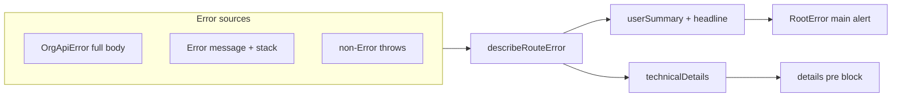

# Root error: plain-English body vs technical details

## Problem

[`src/components/root-error.tsx`](src/components/root-error.tsx) drives the main paragraph from `describeError()`:

- For most `Error` instances, **`summary` is the entire `error.message`** (lines 35–56).
- **[`OrgApiError`](src/server/org-api.server.ts)** sets `message` to the **full HTTP response body** (`throwOrgApiResponseError`), which often includes JSON blobs, HTML, or server traces—not suitable for the primary UI.
- When `message` looks like JSON, the code **pretty-prints it into `summary`** (lines 36–42), which reads like a code dump in the main body.
- **`technical` is only `message`**; **`error.stack` is never rendered** in the details panel, so any stack that matters for debugging is easy to miss while the noisy content incorrectly lands in the headline area.

## Target behavior

| Area | Content |
|------|--------|
| **Main body** (`headline` + short paragraph) | Plain English: status-based explanations, single short sentence from API JSON when safe (e.g. `message` / `detail` string), or a generic line. **No** stack traces, **no** multi-line JSON/code dumps, **no** raw HTML. |
| **Technical details** (`
`) | Full raw `message`, pretty-printed JSON when applicable, and **`error.stack`** for real `Error` instances. Optional: `error.cause` chain if present. |

## Implementation approach (all in app code; no API contract change required)

1. **Introduce a small pure helper module** (recommended: e.g. [`src/lib/describe-route-error.ts`](src/lib/describe-route-error.ts)) exporting something like `describeRouteError(error: unknown)` returning `{ headline, userSummary, technicalDetails }`. Keeps [`root-error.tsx`](src/components/root-error.tsx) mostly presentational and makes the branching logic unit-testable.

2. **Build `technicalDetails` first** (always the “source of truth” dump):
   - Start from `error.message` (for `Error`).
   - Append `\n\n` + `error.stack` when `stack` exists and is not already contained in `message` (avoid duplication).
   - Optionally append serialized `cause` (depth-limited) for modern `Error.cause` chains.
   - For non-`Error` throws, `String(error)` is fine.

3. **Derive `userSummary` + `headline` with defensive rules** (order matters; first match wins):
   - **Reuse existing 401 / session copy** for `status === 401` (same as today).
   - **HTTP status on error** ([`OrgApiError`](src/server/error.ts) exposes `status`): map common codes to short headlines + user text (403, 404, 409, 422, 429, 5xx, etc.). For **5xx**, prefer a calm “we couldn’t complete this request” style line even when the body is `"Internal Server Error"`.
   - **JSON body**: `JSON.parse` when `message` trim starts with `{` or `[`. For **user** text, prefer a **single** short string from common keys (`message`, `detail`, `title`, string `error`) when they look like human prose (trimmed length cap, e.g. 200–300 chars). If the payload is mostly structured validation errors, fall back to status/generic copy rather than dumping objects in the body.
   - **Stack / HTML / noise heuristics**: If `message` looks like a stack trace (e.g. multiline with `at …` patterns), HTML (`<!doctype`, `<html`), or exceeds a length threshold, **do not** show it in `userSummary`; use generic copy and rely on `technicalDetails` for the raw content.
   - **Default**: Short generic sentence (you already have fallback copy when `summary` is null—align that with the new `userSummary`).

4. **Wire `RootError` UI**:
   - Render **`userSummary`** (and `headline`) in the main alert; never render raw `technicalDetails` there.
   - Render **`
` when `technicalDetails.length > 0`**, not only when `import.meta.env.DEV`. Rename label from “Technical details (development)” to something neutral like **“Technical details”** (dev-only framing can move to a small sublabel if you still want to signal environment).
   - **Production note**: Showing full API bodies in prod can leak internals—optional follow-up is to truncate/redact `technicalDetails` in prod while keeping Rollbar logging unchanged. Call this out in code/comments if product wants redaction; default plan assumes **parity** unless you decide otherwise.

5. **Tests**:
   - Add **unit tests** for `describeRouteError` covering: `OrgApiError` + JSON body with nested fields, plain 500 text, stack-like message, 401, non-Error throw.
   - Keep [`tests/root-error.spec.ts`](tests/root-error.spec.ts) as the smoke e2e (still expects `data-testid="root-error"`). Optionally assert the **absence** of a stack line in the visible main region using a thrown error with a distinctive stack line (if stable in CI).

6. **Docs**  
   Update the “Error boundaries” section in [`docs/README.md`](docs/README.md) to state that `RootError` separates **user-facing copy** from **technical details** (message + stack + raw body), pointing at the new helper file.

## Architecture sketch

## Files to touch

- New: [`src/lib/describe-route-error.ts`](src/lib/describe-route-error.ts) (pure logic).
- Update: [`src/components/root-error.tsx`](src/components/root-error.tsx) (import helper, render split, optional prod/dev label).
- New: [`src/lib/describe-route-error.test.ts`](src/lib/describe-route-error.test.ts) (or colocated test per repo convention).
- Update: [`docs/README.md`](docs/README.md) (error boundaries bullet).

No changes required to [`src/server/org-api.server.ts`](src/server/org-api.server.ts) for this UX fix; tightening messages at the source remains an optional later improvement.
