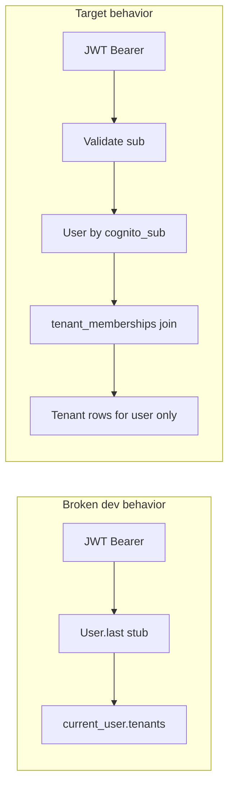

# Scope tenant list to the authenticated user

## Root cause

- **Org-next** loads the sidebar from [`getAppBootstrapData`](apps/org-next/src/server/app-bootstrap.ts), which calls `GET /tenants` with the bearer token via [`getOrgApiJson`](apps/org-next/src/server/org-api.server.ts). No `vendor_id` is sent today.
- **Backend** ([`/Users/duhl/git/anedot_next/app/controllers/tenants_controller.rb`](/Users/duhl/git/anedot_next/app/controllers/tenants_controller.rb)) already uses `current_user.tenants` when `@vendor` is absent, which is the correct **membership join** (`has_many :tenants, through: :tenant_memberships` on [`User`](/Users/duhl/git/anedot_next/app/models/user.rb)).
- The critical gap is **authentication**: [`CognitoJwtAuthentication`](/Users/duhl/git/anedot_next/app/controllers/concerns/cognito_jwt_authentication.rb) currently sets `@current_user = User.last || User.create!(...)` with the real Cognito path **commented out**. That makes every request resolve to the same DB user, which can make the tenant list look “global” or wrong in dev/staging and is unsafe.
- Secondary scope risk: when `vendor_id` is present, `index` returns `@vendor.client_tenants` (all linked client orgs for that vendor). That is **not** the same as “my memberships” and can look like an over-broad list in a tenant switcher if anything ever passes `vendor_id` on this call.

## Recommended implementation (keep `GET /tenants`)

Work in **`anedot_next`** (not under `apps/org-next` in the workspace, but referenced by [apps/org-next/AGENTS.md](apps/org-next/AGENTS.md)):

1. **Restore real JWT authentication** in `CognitoJwtAuthentication`:
   - Decode bearer token, resolve `User` by `cognito_sub` (existing `create_user_from_cognito` flow).
   - Return **401** on invalid/missing token (no silent `User.last`).
   - If you still need a local dev bypass, gate **only** the stub behind an explicit env flag (e.g. `ALLOW_INSECURE_AUTH_STUB`) defaulting to **off**, never enabled in deployed environments.

2. **Harden `TenantsController#index`** (membership-only list):
   - Implement the list as an explicit query on the join, e.g. `Tenant.joins(:tenant_memberships).where(tenant_memberships: { user_id: current_user.id }).distinct` (optionally add `.order(...)` for stable UI). This matches your “filter by that join” requirement and is easy to audit in code review.
   - **Remove the `@vendor.present? ? @vendor.client_tenants : ...` branch** from `index`. Vendor “see all linked clients” behavior should not share the same list endpoint as the org switcher; if product still needs it, expose it under a **separate**, clearly named route later (e.g. vendor-scoped links or a dedicated action) with its own authorization checks. Today, nothing in this `ui` repo calls `GET /tenants` with `vendor_id`.

3. **Tests** (RSpec request specs in `anedot_next`):
   - User A with memberships to tenants {1,2} gets only those; User B’s tenants never appear.
   - Invalid/expired token → 401.

4. **OpenAPI** ([`/Users/duhl/git/anedot_next/doc/openapi.yaml`](/Users/duhl/git/anedot_next/doc/openapi.yaml)): Update `GET /tenants` summary/description to state it returns tenants **for the authenticated user via memberships**; remove or document `VendorId` on the list operation if the vendor branch is removed.

5. **Org-next docs** ([apps/org-next/docs/README.md](apps/org-next/docs/README.md)): One short note that `/tenants` is membership-scoped server-side (per AGENTS “update docs when contract changes”).

No org-next code path changes are required for the URL; mocks in [`tests/get-mock-api-urls.ts`](apps/org-next/tests/get-mock-api-urls.ts) stay valid.

## Out of scope (unless you want a follow-up)

- [`VendorTenantLinksController#index`](/Users/duhl/git/anedot_next/app/controllers/vendor_tenant_links_controller.rb) uses `VendorTenantLink.all` with optional filters — a separate authorization review if that endpoint is exposed.
