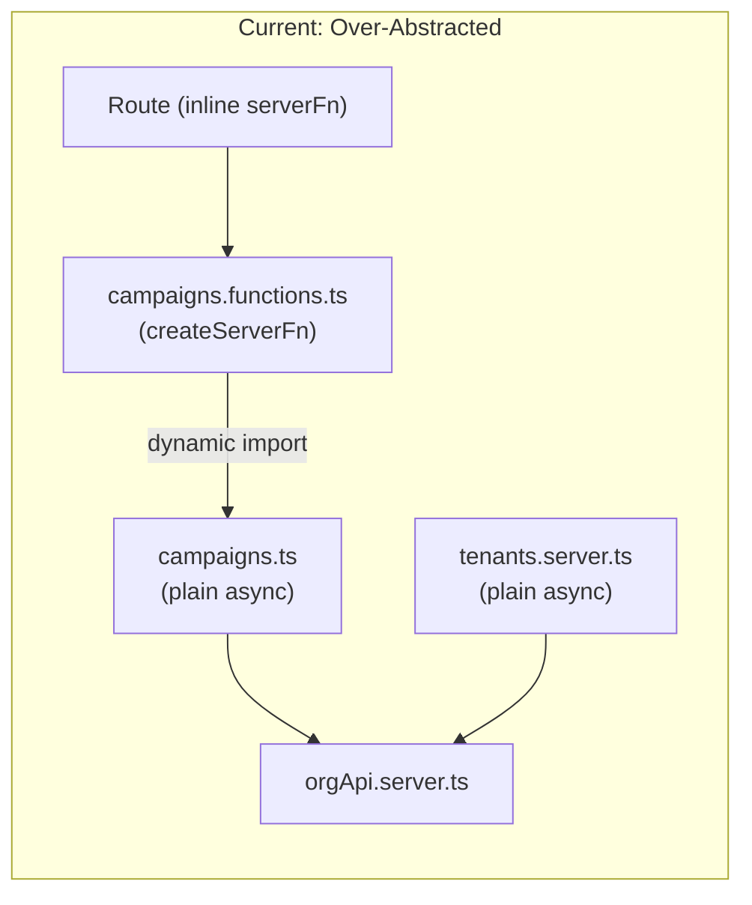
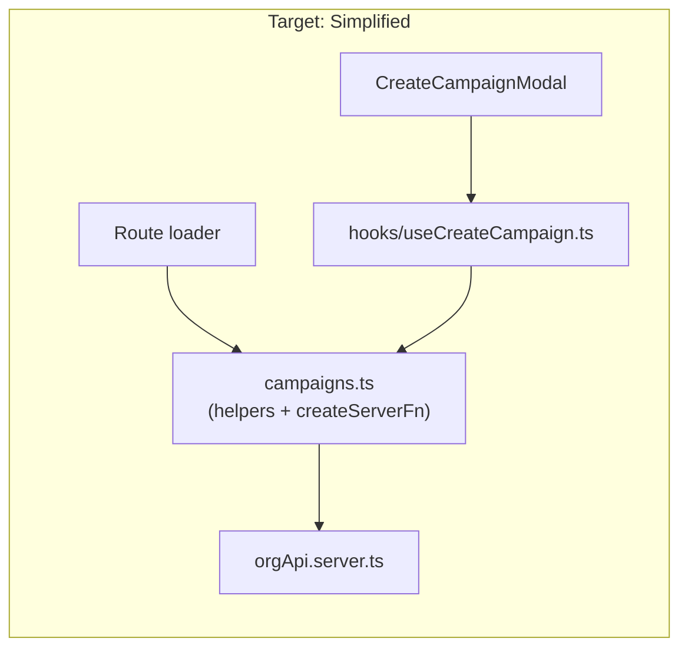

# Server Folder Refactor

## Key Rule

**`createServerFn` must only be defined in `src/server/` files -- never in route files.** Routes import server fns and call them in loaders/components; they never define them.

## Current Problems

The server layer has unnecessary indirection. Each domain has 2-3 files: a plain async "logic" file, a `.functions.ts` file wrapping it in `createServerFn`, and sometimes a `.server.ts` file for server-only operations. Additionally, several route files define `createServerFn` inline rather than importing from `server/`.





## Phase 1: Combine `server/campaigns` files

Combine [`src/server/campaigns.functions.ts`](apps/org-next/src/server/campaigns.functions.ts) into [`src/server/campaigns.ts`](apps/org-next/src/server/campaigns.ts). The `createServerFn` definitions move into the same file as the domain helpers they call. This eliminates the dynamic `import()` indirection -- handlers call helpers directly within the same module.

**After refactor, `campaigns.ts` contains:**
- Non-exported helpers: `requireBootstrapWithTenant`, `campaignsCollectionPath`, `campaignMemberPath`, `assertOrgTenantCanCreateCampaign`
- `listCampaigns` -- `createServerFn({ method: "GET" })`, no input
- `getCampaignDetail` -- `createServerFn({ method: "GET" })`, input: `{ campaignId }`
- `createCampaign` -- `createServerFn({ method: "POST" })`, input: `{ name }`
- `updateCampaign` -- `createServerFn({ method: "POST" })`, input: `{ campaignId, name }`

Each handler includes error handling (OrgApiError 401 -> redirect to `/login`, Rollbar logging) and calls the helpers directly instead of through dynamic import.

**Delete:** `src/server/campaigns.functions.ts` (its content now lives in `campaigns.ts`)

**Update imports in:**
- [`src/routes/_authed/campaigns/$campaignId.tsx`](apps/org-next/src/routes/_authed/campaigns/$campaignId.tsx) -- `getCampaignDetailPageDataFn` / `updateCampaignFn` become `getCampaignDetail` / `updateCampaign` from `@/server/campaigns`
- [`src/components/createCampaignModal.tsx`](apps/org-next/src/components/createCampaignModal.tsx) -- will use a hook instead (Phase 5)

## Phase 2: Combine `server/tenants` files

Combine [`src/server/tenants.functions.ts`](apps/org-next/src/server/tenants.functions.ts) and [`src/server/tenants.server.ts`](apps/org-next/src/server/tenants.server.ts) into a single `src/server/tenants.ts`.

**After refactor, `tenants.ts` exports:**
- `createTenant` -- `createServerFn({ method: "POST" })`, input: `{ name, tenantType }`

The handler calls `postOrgApiJson` directly (no need for a separate `.server.ts` file since `postOrgApiJson` is already `createServerOnlyFn`).

**Delete:** `src/server/tenants.functions.ts`, `src/server/tenants.server.ts` (their content now lives in `tenants.ts`)

**Update imports in:**
- [`src/routes/_authed/organizations.tsx`](apps/org-next/src/routes/_authed/organizations.tsx) -- `createTenantFn` becomes `createTenant` from `@/server/tenants`
- [`src/routes/_authed/workspace/new.tsx`](apps/org-next/src/routes/_authed/workspace/new.tsx) -- same

## Phase 3: Move inline `createServerFn` from routes to `server/`

Three route files violate the key rule by defining `createServerFn` inline. Move each to the appropriate `server/` file.

### 3a: `_authed.tsx` -> `server/appBootstrap.ts`

[`src/routes/_authed.tsx`](apps/org-next/src/routes/_authed.tsx) defines `loadAuthedRouteFn` inline. Move it to [`src/server/appBootstrap.ts`](apps/org-next/src/server/appBootstrap.ts) as `getAppBootstrap` (a `createServerFn({ method: "GET" })`).

Keep `getAppBootstrapData` as a non-exported plain async helper (still used internally by `campaigns.ts`). The new `getAppBootstrap` wraps it with error handling (401 -> redirect to login).

The route becomes a pure importer:

```typescript
import { getAppBootstrap } from "@/server/appBootstrap";

export const Route = createFileRoute("/_authed")({
  loader: async ({ location }) => {
    const appBootstrap = await getAppBootstrap();
    // route-specific redirect logic stays here
    if (appBootstrap.user && !appBootstrap.tenant && !onWorkspaceNewRoute) {
      throw redirect({ to: "/workspace/new" });
    }
    return appBootstrap;
  },
  component: AuthedLayout,
});
```

### 3b: `workspace/new.tsx` -> `server/appBootstrap.ts`

[`src/routes/_authed/workspace/new.tsx`](apps/org-next/src/routes/_authed/workspace/new.tsx) defines `loadWorkspaceNewPageFn` inline. Move it to `server/appBootstrap.ts` as `getWorkspaceNewPageData` (a `createServerFn({ method: "GET" })`). The route imports and calls it in its loader, keeping only route-specific redirect logic inline.

### 3c: `_authed/index.tsx` -> `server/dashboard.ts` (Phase 4)

[`src/routes/_authed/index.tsx`](apps/org-next/src/routes/_authed/index.tsx) defines `getDashboardPageDataFn` inline. This moves into `server/dashboard.ts` in Phase 4.

## Phase 4: Convert `server/dashboard.ts` to export `createServerFn`

[`src/server/dashboard.ts`](apps/org-next/src/server/dashboard.ts) currently exports a plain async function `getDashboardPageData`. Convert it to export a `createServerFn` named `getDashboardData`, absorbing the inline server fn from `_authed/index.tsx` (Phase 3c). The error handling (OrgApiError 401 -> redirect, Rollbar) moves into the handler.

The route becomes a pure importer:

```typescript
import { getDashboardData } from "@/server/dashboard";

export const Route = createFileRoute("/_authed/")({
  loader: () => getDashboardData(),
  component: HomePage,
});
```

No `createServerFn` or `@tanstack/react-start` import remains in the route file.

## Phase 5: Create `hooks/` and extract component data fetching

Create `src/hooks/` directory per AGENTS.md.

**`src/hooks/useCreateCampaign.ts`** -- Extracts the mutation logic currently in [`src/components/createCampaignModal.tsx`](apps/org-next/src/components/createCampaignModal.tsx). Pattern follows the dashboard's hook style but for a mutation:

```typescript
import { useMutation } from "@tanstack/react-query";
import { createCampaign } from "@/server/campaigns";

export function useCreateCampaign() {
  return useMutation({
    mutationFn: (data: { name: string }) =>
      createCampaign({ data }),
  });
}
```

Update `CreateCampaignModal` to use this hook instead of importing the server fn directly. The component should not import from `@/server/` -- it uses the hook as a pass-through layer.

## Phase 6: Rename non-camelCase files

Per AGENTS.md: "New file names should always be camel case." Fix existing kebab-case files:

- `server/org-api-access-token.server.ts` -> `server/orgApiAccessToken.server.ts`
- `lib/org-api-scoped-path.ts` -> `lib/orgApiScopedPath.ts`
- `lib/campaign-api-scope.ts` -> `lib/campaignApiScope.ts`
- `components/app-header.tsx` -> `components/appHeader.tsx`
- `components/marketing-carousel.tsx` -> `components/marketingCarousel.tsx`
- `components/root-not-found.tsx` -> `components/rootNotFound.tsx`
- `components/ui/rating-star-icon.tsx` -> `components/ui/ratingStarIcon.tsx`

Update all imports referencing renamed files. Update corresponding test file names too (`lib/org-api-scoped-path.test.ts` -> `lib/orgApiScopedPath.test.ts`, etc.).

## Phase 7: Validate

Run `pnpm run validate` from the repo root to confirm lint, build, typecheck, and tests all pass.

## Final server/ structure

```
src/server/
  appBootstrap.ts          -- getAppBootstrap, getWorkspaceNewPageData (createServerFn) + internal helper
  authSession.ts           -- auth session management (unchanged)
  campaigns.ts             -- helpers + listCampaigns, getCampaignDetail, createCampaign, updateCampaign (createServerFn)
  campaigns.test.ts        -- updated tests
  dashboard.ts             -- getDashboardData (createServerFn)
  env.server.ts            -- server-only env config (unchanged)
  error.ts                 -- OrgApiError (unchanged)
  orgApi.server.ts         -- HTTP client (unchanged)
  orgApiAccessToken.server.ts -- token resolution (renamed from org-api-access-token.server.ts)
  rollbarServer.server.ts  -- Rollbar (unchanged)
  session.ts               -- cookie sessions (unchanged)
  tenants.ts               -- createTenant (createServerFn)
```

**Deleted:** `campaigns.functions.ts`, `tenants.functions.ts`, `tenants.server.ts` (all content moved into their domain file)
