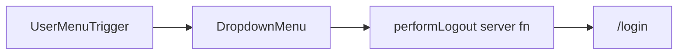

# Sidebar user menu and logout

## Context

- **Target file:** [`apps/org-next/src/routes/_authed/-app-sidebar.tsx`](apps/org-next/src/routes/_authed/-app-sidebar.tsx) — already uses `DropdownMenu`, `SidebarMenuButton`, and a bottom strip with `SidebarTrigger`.
- **Auth:** [`apps/org-next/src/routes/-auth.ts`](apps/org-next/src/routes/-auth.ts) exports `performLogout` (TanStack `createServerFn` POST). The UI should `await performLogout()` from the client, then send the browser to [`/login`](apps/org-next/src/routes/login.tsx) (full `window.location.assign` is safer than client-only navigation so server-rendered session state and loaders line up with cleared cookies).
- **User data:** The `_authed` loader already returns `AppBootstrap`, which includes [`user` / `currentUser`](apps/org-next/src/types/bootstrap.ts) with **email** (no display `name` field). You chose a **read-only email header in the menu**; use `user.email` (or `currentUser`, they are the same in bootstrap).
- **Layout primitive:** [`SidebarFooter`](packages/ui/src/components/ui/sidebar.tsx) in `@workspace/ui` **includes `SidebarTrigger` as the last child**. Replacing the current hand-rolled bottom `border-t` block (which only wraps `SidebarTrigger`) with `SidebarFooter` avoids duplicating the trigger and matches the pattern used by the internal `AppShell` (user block + default trigger). Apply `className` on `SidebarFooter` (e.g. `border-t border-sidebar-border`, `justify-between gap-2`, `w-full`) so the user control and trigger share the row cleanly in expanded mode and look acceptable when collapsed (footer uses `data-[collapsed=true]:flex-col-reverse` — verify visually; tweak padding/`flex-1` on the user trigger if needed).

## UI behavior (idiomatic shadcn / consistent with this app)

- **Trigger:** `SidebarMenuButton` (same family as the tenant switcher) with a **circular “avatar”** on the left: default **solid blue** background (`bg-primary` or a fixed `bg-blue-600` if you want it explicitly blue) and **initials** derived from the email (e.g. new small helper, or reuse/extend [`getTenantInitials`](apps/org-next/src/lib/tenant-initials.ts) on the local part of the email with safe fallbacks like `"?"`).
- **Expanded:** Show truncated email (or a short label) and `ChevronsUpDown` like the org switcher; **collapsed:** icon/initials only, with `title` for full email.
- **Menu content:** `DropdownMenuContent` with `align`/`side` mirroring the tenant menu (`side={collapsed ? "right" : "top"}` or `"bottom"` — match what reads best next to the footer). Use a **non-interactive header block** (email text, `text-sm` + muted) then `DropdownMenuSeparator`, then a single **“Log out”** `DropdownMenuItem` with `LogOut` icon from `lucide-react`. Optional: `DropdownMenuItem` in **destructive** tone if the design system exposes a variant, or `text-destructive` on the item for emphasis.
- **Async logout:** On select, call `void (async () => { await performLogout(); window.location.assign("/login"); })()` or a small `handleLogout` with **pending state** (disable item / show subtle loading) to prevent double-clicks.

## Edge cases

- **Dev auth bypass** (`VITE_TEMP_BYPASS_AUTH`): Logout may still POST to the auth app; if that fails in local dev, decide whether to still navigate to `/login` (document or handle error — keep minimal: try/catch and optional toast or `console.error` only if the project already has a pattern).

## Out of scope (per your choices)

- No changes to [`packages/ui` NavUser](packages/ui/src/components/nav-user.tsx) or barrel exports; no new menu links beyond email + log out.
- No README/docs updates unless you ask.

## Files to touch (expected)

1. [`apps/org-next/src/routes/_authed/-app-sidebar.tsx`](apps/org-next/src/routes/_authed/-app-sidebar.tsx) — `useLoaderData` for `user`, import `performLogout`, implement footer `DropdownMenu`, swap bottom section for `SidebarFooter` + user row.
2. [`apps/org-next/src/lib/tenant-initials.ts`](apps/org-next/src/lib/tenant-initials.ts) (or a tiny new util next to the sidebar) — **optional** `getInitialsFromEmail` if you do not want to overload tenant naming.
3. **Manual check:** Logged-in user sees menu at bottom; log out clears session and lands on login; keyboard and screen reader (`aria-label` on trigger, e.g. “Account menu”).

