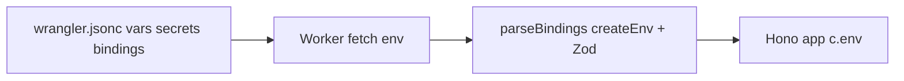

# Type-safe env with @t3-oss/env-core

## Current state

- [src/env.ts](apps/api/src/env.ts) only exports manual `Bindings` / `AppEnv` types (no runtime validation).
- [wrangler.jsonc](apps/api/wrangler.jsonc) defines string vars, required secrets (`DATABASE_URL`, `LOGTAIL_SOURCE_TOKEN`), and `API_RATE_LIMITER` rate-limit binding.
- [worker-configuration.d.ts](apps/api/worker-configuration.d.ts) is **stale** (no `LOGTAIL_SOURCE_TOKEN`); run `pnpm cf-typegen` before wiring the schema.
- `@t3-oss/env-core` and `zod` are in **devDependencies** but must run inside the Worker bundle for runtime validation → move to **dependencies**.
- Tests pass a partial `Bindings` object to `app.request()` without Logtail secrets ([src/routes/index.test.ts](apps/api/src/routes/index.test.ts)).

## Type relationship: Wrangler `Env` vs T3 `Bindings`

**No — `createEnv` does not extend or inherit from Wrangler’s generated `Env` interface.** They are separate:

| | Wrangler `Env` | T3 `Bindings` |
|--|----------------|---------------|
| Source | `wrangler.jsonc` → `pnpm cf-typegen` → [worker-configuration.d.ts](apps/api/worker-configuration.d.ts) | Zod schema in [src/env.ts](apps/api/src/env.ts) → `createEnv` / `ReturnType<typeof parseBindings>` |
| Role | Shape of what Cloudflare **passes in** at `fetch(_, env, _)` | Shape of what the app **uses after validation** (often stricter) |

**How they connect in the plan:**

1. **Input:** `parseBindings(runtimeEnv: Env)` — parameter is Wrangler’s `Env`.
2. **Output:** `Bindings` is inferred from Zod, not from `extends Env`.
3. **Compile-time drift guard (recommended):** add a type-only check so every Wrangler key is either validated or intentionally omitted:

```ts
type WranglerKeys = keyof Env
type ValidatedKeys = keyof Bindings
type _EnsureCoverage = Exclude<WranglerKeys, ValidatedKeys> extends never
  ? true
  : ['Missing in Zod schema:', Exclude<WranglerKeys, ValidatedKeys>]
```

If `LOGTAIL_ENDPOINT` exists only in Zod but not in `wrangler.jsonc`, `Env` won’t include it until you add it to Wrangler (or you treat it as Node-only in `nodeEnv`).

**Why not `Bindings extends Env`?** Wrangler often types `vars` as string literals (e.g. `ENVIRONMENT: "development"`), while Zod may widen to `z.enum([...])` or apply defaults — the validated type is usually **narrower or equal**, not a subclass. `API_RATE_LIMITER` stays typed as `RateLimit` via `z.custom<RateLimit>()` aligned with the global from `worker-configuration.d.ts`.

**Practical rule:** `wrangler.jsonc` + `cf-typegen` = inventory of bindings; Zod = validation rules; `runtimeEnvStrict` + the coverage check = keep them in sync.

## Architecture

Cloudflare Workers do not have `process.env` at runtime; bindings arrive on the `env` argument to `fetch`. T3 Env’s `createEnv` still fits via a **factory** that takes the Worker `Env` object as `runtimeEnv` (or `runtimeEnvStrict`).



## Implementation

### 1. Regenerate Wrangler types

Run from `apps/api`:

```sh
pnpm cf-typegen
```

Confirm [worker-configuration.d.ts](apps/api/worker-configuration.d.ts) includes at least:

- `DATABASE_URL: string`
- `LOGTAIL_SOURCE_TOKEN: string` (from `secrets.required`)
- `ENVIRONMENT`, `CORS_ORIGIN`, `LOG_LEVEL` (from `vars`)
- `API_RATE_LIMITER: RateLimit`

### 2. Move runtime packages

In [package.json](apps/api/package.json):

- Add `@t3-oss/env-core` and `zod` to `dependencies` (remove from `devDependencies`).

### 3. Rewrite [src/env.ts](apps/api/src/env.ts)

Structure:

```ts
import { createEnv } from '@t3-oss/env-core'
import { z } from 'zod'
import type { PinoLogger } from 'hono-pino'

// Shared server schema (reused by Worker + Node tooling)
const server = {
  DATABASE_URL: z.url(),
  LOGTAIL_SOURCE_TOKEN: z.string().min(1),
  LOGTAIL_ENDPOINT: z.url().optional(),
  CORS_ORIGIN: z.string().min(1).default('http://localhost:3209'),
  ENVIRONMENT: z.enum(['development', 'staging', 'production', 'test']).default('development'),
  LOG_LEVEL: z.enum(['fatal', 'error', 'warn', 'info', 'debug', 'trace', 'silent']).default('info'),
  API_RATE_LIMITER: z.custom<RateLimit>(/* has limit() */).optional(),
} as const

export function parseBindings(runtimeEnv: Env): Bindings { ... }

export type Bindings = ReturnType<typeof parseBindings>
export type AppEnv = { Bindings: Bindings; Variables: { ... } }
```

Details:

- Use `emptyStringAsUndefined: true` (T3 recommendation for `.dev.vars` / empty strings).
- Use `runtimeEnvStrict` mapping every schema key from the incoming `Env` object so missing keys fail at type level and runtime.
- `API_RATE_LIMITER`: validate with `z.custom<RateLimit>()` (check `limit` is a function); keep **optional** so unit tests and routes outside `/api/` still work when the binding is absent.
- `LOGTAIL_ENDPOINT`: optional; default in app code only if needed later (not in wrangler today).
- Export `parseBindings` for the Worker entrypoint and tests.

Optional **Node-only** export in the same file (or `src/env.node.ts` if bundle size matters):

```ts
export const nodeEnv = createEnv({
  server: pick(server, ['DATABASE_URL', ...]),
  runtimeEnv: process.env,
  emptyStringAsUndefined: true,
})
```

Use this from [drizzle.config.ts](apps/api/drizzle.config.ts) after the existing `.dev.vars` loader so migrations get the same Zod rules as the Worker (replace ad-hoc `DATABASE_URL` check).

### 4. Validate at the Worker boundary

Update [src/index.ts](apps/api/src/index.ts) from `export default app` to a small Worker module:

```ts
import app from './app'
import { parseBindings } from './env'

export default {
  fetch(request, env, ctx) {
    return app.fetch(request, parseBindings(env), ctx)
  },
}
```

This validates once per request before Hono runs; invalid config returns a 500 via thrown validation error (customize with `onValidationError` in `createEnv` if you want a JSON error body).

### 5. Align tests and examples

- Update [src/routes/index.test.ts](apps/api/src/routes/index.test.ts) and [src/routes/hellos/hellos.test.ts](apps/api/src/routes/hellos/hellos.test.ts) to use `parseBindings({ ... })` (or a `createTestBindings()` helper) including `LOGTAIL_SOURCE_TOKEN: 'test-token'`.
- Uncomment / document Logtail vars in [.dev.vars.example](apps/api/.dev.vars.example) to match required secret.

### 6. Keep Hono types unchanged

No changes needed to middleware/route files beyond types flowing from `AppEnv` — they already import `AppEnv` / `Bindings` from `../env`.

Remove redundant `?? 'development'` / `?? 'info'` only where Zod defaults make them unnecessary (optional cleanup in [src/routes/index.route.ts](apps/api/src/routes/index.route.ts), [src/middlewares/pino-logger.ts](apps/api/src/middlewares/pino-logger.ts), [src/middlewares/cors.ts](apps/api/src/middlewares/cors.ts)).

## Validation rules (summary)

| Variable | Rule |
|----------|------|
| `DATABASE_URL` | required URL (postgres connection string) |
| `LOGTAIL_SOURCE_TOKEN` | required non-empty string |
| `LOGTAIL_ENDPOINT` | optional URL |
| `CORS_ORIGIN` | non-empty string, default localhost |
| `ENVIRONMENT` | enum incl. `test` for Vitest |
| `LOG_LEVEL` | pino levels + `silent` |
| `API_RATE_LIMITER` | optional `RateLimit` binding |

## Verification

```sh
pnpm --filter api cf-typegen
pnpm --filter api typecheck
pnpm --filter api test
```

Manual: `pnpm dev` with `.dev.vars` containing required secrets; hit `/health` and confirm startup fails fast with a clear message if `DATABASE_URL` or `LOGTAIL_SOURCE_TOKEN` is missing.

## Notes

- You mentioned `BS_SOURCE_*`; the repo uses **Logtail / Better Stack** names (`LOGTAIL_SOURCE_TOKEN`, `LOGTAIL_ENDPOINT`). The plan follows the current wrangler + env.ts naming.
- Wrangler `Env` = source of truth for **which bindings exist**; Zod = source of truth for **validated app types** (`Bindings`). They are linked via `parseBindings(env: Env)` and a compile-time key coverage check, not `extends`.
