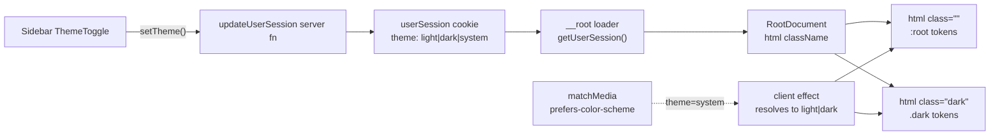

## Critical finding before planning

org-next persists `theme: "light" | "dark" | "system"` in a signed cookie via [src/server/user-session.server.ts](apps/org-next/src/server/user-session.server.ts) and exposes it through [src/hooks/use-user-session.ts](apps/org-next/src/hooks/use-user-session.ts), but **nothing in the app applies the `.dark` class to `<html>` or honors `system`**:

- `[src/routes/__root.tsx](apps/org-next/src/routes/__root.tsx)` renders `<html lang="en">` with no `className` derived from theme.
- No `ThemeProvider` / `next-themes` import in `apps/org-next` (grep is empty).
- `[src/styles.css](apps/org-next/src/styles.css)` declares `@custom-variant dark (&:is(.dark *));`, so the entire dark token set in `[packages/ui/src/styles/theme.css](packages/ui/src/styles/theme.css)` is dormant.
- `[src/styles.css](apps/org-next/src/styles.css)` line 72 hardcodes `a { color: oklch(42.4% 0.199 265.638); }` — won't change in dark mode (a real a11y bug).
- The sidebar in [src/routes/_authed/-app-sidebar.tsx](apps/org-next/src/routes/_authed/-app-sidebar.tsx) has no theme toggle.

Conclusion: testing without first wiring will only confirm the bug. The plan therefore has a small implementation slice followed by layered verification.

## Assumptions (call these out if wrong)

- "Theming" in this request means light / dark / system, not per-tenant brand theming.
- We target **WCAG 2.1 AA** for contrast and standard a11y (keyboard, focus, ARIA).
- We use the SSR cookie as the source of truth (avoid `next-themes`, since org-next is TanStack Start, not Next).
- e2e scope: representative routes — `/login`, `/`, `/organizations/new`, `/campaigns` — both modes.

## Architecture: how theme actually gets applied



## Implementation slice (minimum viable wiring)

1. **Resolve theme in `__root` shell** — `[src/routes/__root.tsx](apps/org-next/src/routes/__root.tsx)`:
   - Read `userSession.theme` from `useLoaderData()`.
   - On SSR: if `theme === "dark"` set `<html class="dark">`. For `system`, render `<html>` (no class) and rely on the client effect — accept a brief flash for `system` users (document this trade-off) OR send a `Sec-CH-Prefers-Color-Scheme`-aware default if we want zero flash later.
   - Add a small client `useEffect` that, when `theme === "system"`, listens to `window.matchMedia("(prefers-color-scheme: dark)")` and toggles `document.documentElement.classList.toggle("dark", ...)`.
   - Set `<meta name="color-scheme">` so native form controls match.

2. **Theme toggle in sidebar footer** — extend [src/routes/_authed/-app-sidebar.tsx](apps/org-next/src/routes/_authed/-app-sidebar.tsx) with a small inline `ThemeToggle` (sun / moon / monitor) calling `useUserSession().setTheme(...)`. Don't import `packages/ui`'s `next-themes`-based `ThemeToggle` (`[packages/ui/src/components/theme-toggle.tsx](packages/ui/src/components/theme-toggle.tsx)`) — it would fight the cookie source of truth. Use `aria-label` + `aria-pressed`, kebab-case file `-theme-toggle.tsx`.

3. **Fix the hardcoded link color** in `[src/styles.css](apps/org-next/src/styles.css)`: replace the raw `oklch(...)` with a token-based color (e.g. `text-secondary-700` equivalent / a new `--link` pair in `theme.css`) so links are legible in dark mode.

## Verification layers

### Playwright e2e — `tests/theme.spec.ts`

Use the existing fixture in `[tests/test-fixture.ts](apps/org-next/tests/test-fixture.ts)` (it already waits for `__HYDRATED__` and forwards RMP).

- **Light persisted via cookie**: set the `userSession` cookie via `context.addCookies` to `theme: "light"`, navigate, assert `html.className` does **not** contain `dark` and `getComputedStyle(body).backgroundColor` matches the light `--background` token.
- **Dark persisted via cookie**: same, with `theme: "dark"`, assert `html` has class `dark`.
- **System honored**: set `theme: "system"`, use `page.emulateMedia({ colorScheme: "dark" })` and assert `html.dark` is present; flip to `"light"` and assert it's removed (no full reload).
- **Toggle persists across reload**: from `/`, click the moon button, assert `html.dark`, reload, assert still dark (cookie round-trip).
- **No FOUC for explicit choice**: navigate cold and assert the `dark` class is set on the **first** rendered HTML (use `page.content()` before hydration via a route that 200s without React; or assert `html` class matches before `__HYDRATED__` resolves by reading `await page.evaluate` in a `'domcontentloaded'` waitFor).

### Automated a11y — axe-core via `@axe-core/playwright`

Add dev dep `@axe-core/playwright`, plus a small helper `tests/axe-helpers.ts`:

```ts
const results = await new AxeBuilder({ page })
  .withTags(["wcag2a", "wcag2aa", "wcag21aa"])
  .analyze();
expect(results.violations).toEqual([]);
```

Run it across the matrix `{ /login, /, /organizations/new, /campaigns } × { light, dark }`. Use `mockServerRequest` for routes behind `_authed` (mirrors `[tests/app-sidebar.spec.ts](apps/org-next/tests/app-sidebar.spec.ts)`).

### Token contrast — `tests/theme-contrast.spec.ts` (Vitest)

Pure-data check on `[packages/ui/src/styles/theme.css](packages/ui/src/styles/theme.css)`:

- Parse the `:root` and `.dark` blocks; for each foreground/background pair (`background`/`foreground`, `card`/`card-foreground`, `popover`/`popover-foreground`, `primary`/`primary-foreground`, `secondary`/`secondary-foreground`, `muted`/`muted-foreground`, `accent`/`accent-foreground`, `destructive`/`destructive-foreground`, `success`/`success-foreground`, `warning`/`warning-foreground`, `sidebar-background`/`sidebar-foreground`, `sidebar-accent`/`sidebar-accent-foreground`), assert WCAG AA contrast (>= 4.5:1 normal text, >= 3:1 large/UI). Use `culori` or `colorjs.io` to compute relative luminance from oklch.

Decision needed if any pair fails: tweak the token (one-line oklch nudge) or accept and add an explicit allowlist with justification.

### Manual a11y checklist — `[apps/org-next/docs/theming.md](apps/org-next/docs/theming.md)` (new doc)

Items the automated layer can't reliably catch:

- Keyboard: tab order through toggle; `Enter` / `Space` activate.
- Focus visibility: `:focus-visible` ring contrast in both modes (especially the muted dark `--ring`).
- Screen reader: announces "Light", "Dark", "System" with `aria-pressed` state changes.
- `prefers-reduced-motion`: theme transition (if any) is suppressed.
- Form controls / scrollbars adopt the right scheme via `color-scheme` (already in `theme.css`).
- Print preview is legible.

### Visual regression (optional but cheap)

Two `toHaveScreenshot()` snapshots — sidebar in light and dark — to catch drift if anyone tweaks tokens. Keep to one component, not full pages, to avoid flake.

## Doc updates (don't skip)

- `[apps/org-next/docs/README.md](apps/org-next/docs/README.md)`: add a short "Theming" section linking to:
  - `__root.tsx` (where the `dark` class is applied)
  - the new `-theme-toggle.tsx`
  - the cookie shape (already documented)
  - the new `tests/theme.spec.ts` and `theme-contrast.spec.ts`
- New `[apps/org-next/docs/theming.md](apps/org-next/docs/theming.md)`: SSR/system-preference trade-off, manual a11y checklist, how to add a new token pair (must include AA contrast in both modes).

## Validation order

1. `pnpm --filter org-next typecheck`
2. `pnpm --filter org-next test` (contrast unit test)
3. `pnpm --filter org-next e2e -- theme.spec.ts a11y.spec.ts`
4. `pnpm run validate` at the repo root before opening the PR (per `.cursor/rules/toolchain.mdc`).

## Out of scope (flag now if any of these belong in scope)

- Per-tenant brand theming.
- High-contrast mode or custom user palettes.
- Dark-mode handling for Storybook (different concern in `apps/storybook`).
- Email / printable templates.
- Migration of the global `theme` cookie to a separate cookie (it already coexists with `selectedTenantId`).
