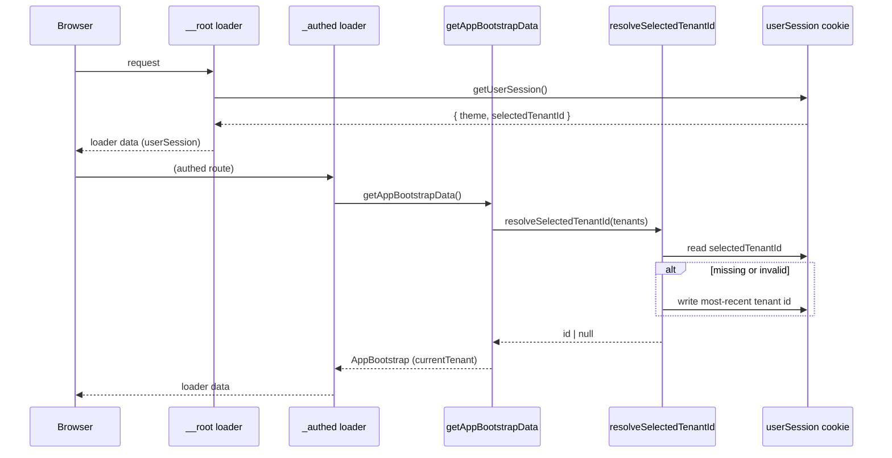

## Shape

Store a small `userSession` object in a single signed, `httpOnly` cookie (same pattern as the existing cookies in [src/server/session.server.ts](apps/org-next/src/server/session.server.ts)). The client never reads the cookie directly — it receives the current value through the root route loader and mutates it through a server function. A thin React hook (`useUserSession`) wraps the loader data + mutation so components treat it like ordinary state.

```ts
type UserSession = {
  selectedTenantId: number | null;
  theme: "light" | "dark" | "system";
};
```

- Defaults: `{ selectedTenantId: null, theme: "system" }`.
- `selectedTenantId` resolution (runs where we already fetch tenants, in `getAppBootstrapData`):
  1. Read from cookie. Valid if it matches a tenant id in the fetched `tenants` list.
  2. Otherwise, pick the tenant with the greatest `updated_at`, persist it to the cookie, and return that.
  3. If `tenants` is empty, keep `null` (allowed state).

## Key files

### New

- [src/server/user-session.server.ts](apps/org-next/src/server/user-session.server.ts) — wraps `useSession` (server-only) with a `UserSession` shape and signed, `httpOnly` cookie. Exports two server-only helpers used by the server functions below.

  ```ts
  import { createServerOnlyFn } from "@tanstack/react-start";
  import { useSession } from "@tanstack/react-start/server";
  import { env } from "@/env";

  export type UserSession = {
    selectedTenantId: number | null;
    theme: "light" | "dark" | "system";
  };

  const DEFAULTS: UserSession = { selectedTenantId: null, theme: "system" };

  export const useUserSessionStore = createServerOnlyFn(() =>
    useSession<Partial<UserSession>>({
      password: env.SESSION_SECRET,
      name: "userSession",
      cookie: {
        httpOnly: true,
        sameSite: "lax",
        secure: import.meta.env.MODE === "production",
        maxAge: 3600 * 24 * 365,
        path: "/",
      },
    }),
  );

  // read + merge with defaults, and update helpers
  ```

- [src/server/user-session.ts](apps/org-next/src/server/user-session.ts) — public-facing, used by loaders/route code:
  - `getUserSession` — `createServerFn` that reads the cookie and returns a fully-populated `UserSession`.
  - `updateUserSession` — `createServerFn` that takes a `Partial<UserSession>`, validates with zod, merges, writes the cookie, and returns the new value.
  - `resolveSelectedTenantId(tenants: Tenant[])` — server-only helper used by `getAppBootstrapData`: reads the cookie, validates the stored id against `tenants`, falls back to the tenant with max `updated_at`, persists the fallback, and returns the id (or `null` if no tenants).

- [src/hooks/use-user-session.ts](apps/org-next/src/hooks/use-user-session.ts) — React hook used by components:
  - Reads the current value from the root route loader via `getRouteApi("__root__").useLoaderData()` (or from `_authed` if we keep it there — see below).
  - Exposes `{ session, setSession, setTheme, setSelectedTenantId }` where the setters call `useMutation({ mutationFn: updateUserSession })` and invalidate the route on success so loaders see the new value.

### Modified

- [src/routes/__root.tsx](apps/org-next/src/routes/__root.tsx) — add a `loader` that calls `getUserSession()` and returns `{ userSession }`. This makes the session available on every route (including unauthenticated ones) so `theme` applies immediately after SSR.
- [src/server/app-bootstrap.ts](apps/org-next/src/server/app-bootstrap.ts) — after `fetchTenants`, call `resolveSelectedTenantId(tenants)` instead of the current unused `tenantId` argument and use the returned id to compute `currentTenant`. Replace:
  
  ```ts
  const currentTenant = tenantId
    ? (tenants.find((tenant) => tenant.id === tenantId) ?? null)
    : null;
  ```
  
  with a call to the new resolver. This is the single place that persists a fallback tenant id to the cookie.
- [src/components/app-header.tsx](apps/org-next/src/components/app-header.tsx) — replace the hard-coded `currentTenantName = "test"` with data from `useUserSession` + bootstrap loader data (future work: theme toggle wired to `setTheme`). Only the minimum wiring needed for this change.

## Flow



## Client usage

```ts
const { session, setTheme, setSelectedTenantId } = useUserSession();
// session.theme, session.selectedTenantId
await setTheme("dark");
```

## Server / loader usage

```ts
import { getUserSession } from "@/server/user-session";

export const Route = createFileRoute("/some/route")({
  loader: async () => {
    const session = await getUserSession();
    return { theme: session.theme };
  },
});
```

## Validation and tests

- Unit test `resolveSelectedTenantId` in `src/server/user-session.test.ts` covering: empty tenants, invalid stored id, valid stored id, picking max `updated_at`.
- `pnpm --filter org-next typecheck` and `pnpm --filter org-next check`.

## Docs

- Update [apps/org-next/docs/README.md](apps/org-next/docs/README.md): add a short "User session cookie" section under the existing "Tenant bootstrap" section pointing at `src/server/user-session.ts` and documenting the cookie name, defaults, and the fallback rule for `selectedTenantId`.