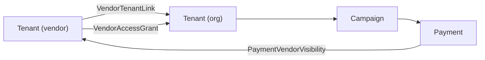

# Vendor Account Capabilities Analysis

## What Is a Vendor Account?

A **vendor** is not a separate model -- it is a `Tenant` record with `tenant_type: "vendor"` (as opposed to `"org"`). Vendors are platform-level entities (think: fundraising platforms, consultancies, resellers) that manage multiple client organizations on Anedot's behalf. Users belong to vendor tenants via the same `TenantMembership` join as org tenants.

The core relationship chain is:

---

## Existing Backend Capabilities

### 1. Vendor-Client Linking ([app/models/vendor_tenant_link.rb](app/models/vendor_tenant_link.rb))

- Links a vendor tenant to a client org tenant via `VendorTenantLink`
- Statuses: `active` | `revoked` (with `revoked_at` timestamp)
- Unique constraint: one link per vendor+client pair
- API: `GET/POST /vendor-links`, `GET /vendor-links/:id`

### 2. Scoped Access Grants ([app/models/vendor_access_grant.rb](app/models/vendor_access_grant.rb))

- Fine-grained permission model per vendor+client pair
- **Scopes**: `billing`, `donors`, `compliance`, `pages`, `exports`, `everything`
- **Roles**: `admin`, `editor`, `viewer`
- **Custom permissions**: `permissions_json` (JSONB) for arbitrary overrides
- Unique constraint: one grant per vendor+client+scope triple
- API: `GET/POST /vendor-grants`, `GET/DELETE /vendor-grants/:id`

### 3. Vendor Context Switching ([app/controllers/application_controller.rb](app/controllers/application_controller.rb))

- Any API call can pass `?vendor_id=<tenant_id>` to enter "vendor mode"
- `set_vendor` resolves the vendor tenant from the current user's tenants
- `set_tenant` then resolves the target org as one of the vendor's `client_tenants` (not the user's own tenants)
- `campaign_scope` filters campaigns to only those where `campaign.vendor_id == @vendor.id`

### 4. Campaign Ownership by Vendor ([app/models/campaign.rb](app/models/campaign.rb))

- `campaigns.vendor_id` FK to `tenants` -- campaigns created in vendor context are stamped with the vendor
- When in vendor context, only vendor-owned campaigns are visible

### 5. Payment Visibility ([app/models/payment.rb](app/models/payment.rb))

- `PaymentVendorVisibility` is a denormalized join: payment + vendor_tenant
- Auto-populated on payment creation via `after_create :populate_vendor_visibilities` -- looks up all active `VendorTenantLink`s for the payment's tenant and creates visibility rows
- Payments can be queried with `?vendor_tenant_id=X` to return only payments visible to that vendor

### 6. Resource Access Control

Resources accessible in vendor context (via `vendor_id` query param):
- Tenants (lists client tenants), Campaigns, Campaign Pages, Contacts, Campaign Contacts, Payments, Merchants

Resources explicitly **blocked** for vendors (`prevent_vendor_access`):
- Invites, Tenant Memberships, Submerchants

---

## Recommended Frontend UI Features

Given the backend capabilities, here are the UI features a frontend should implement to optimally use the vendor system:

### A. Vendor Dashboard / Home

- **Client Organization List** -- table/cards of all linked client orgs (from `GET /tenants?vendor_id=X`), showing name, link status, and grant count
- **Aggregate Stats** -- total payments across all clients, total campaigns, active vs. revoked links
- **Quick-switch Selector** -- a persistent tenant picker in the nav/header that lets the vendor user select which client org they are currently "acting as"

### B. Client Relationship Management

- **Link Management UI** -- create new vendor-client links (`POST /vendor-links`), view existing links, revoke links (currently no `PATCH`/`PUT` on links, so revoking would need a backend addition or a status-update endpoint)
- **Link Status Indicators** -- clearly show `active` vs `revoked` with timestamps
- **Client Onboarding Wizard** -- guided flow to link a new client org, set up initial access grants, and optionally create their first campaign

### C. Access Grant / Permissions Management

- **Per-Client Grants Matrix** -- a grid or checklist UI showing which scopes (`billing`, `donors`, `compliance`, `pages`, `exports`, `everything`) are granted for each client, with role level (`admin`/`editor`/`viewer`)
- **Grant CRUD** -- create, view, and delete grants; visually grouped by client org
- **Bulk Grant Templates** -- quick-apply a common set of scopes (e.g., "Full Access" = `everything` + `admin`, "Read-Only Reporting" = `billing` + `donors` + `viewer`)

### D. Campaign Management (Vendor Context)

- **Vendor Campaign List** -- shows only campaigns owned by the vendor for the selected client (filtered by `vendor_id`)
- **Campaign Creation** -- when creating a campaign in vendor context, the backend auto-stamps `campaign.vendor = @vendor`; the UI should make it clear this is a vendor-managed campaign
- **Campaign Pages** -- full CRUD on pages within vendor-scoped campaigns

### E. Payment / Transaction Reporting

- **Cross-Client Payment Dashboard** -- query `GET /payments?vendor_tenant_id=X` to show all payments visible to the vendor across all clients
- **Per-Client Payment View** -- filter by specific client tenant
- **Payment Search & Export** -- search, sort, and export payment data (leveraging the `exports` access grant scope)

### F. Contact Management (Vendor Context)

- **Client Contact Directory** -- view contacts for the selected client org
- **Campaign Contact Attribution** -- see which contacts came through which campaign/page

### G. Merchant Visibility

- **Client Merchant Overview** -- read-only view of each client's merchant and submerchant setup (vendors can see merchants but submerchant access is blocked)
- **Merchant Application Status** -- view merchant application states for client orgs

### H. Navigation and Context

- **Vendor/Org Mode Toggle** -- if a user belongs to both a vendor tenant and org tenants, the UI needs a clear mode switch (e.g., "Switch to Vendor View" / "Switch to Org View")
- **Breadcrumb Context** -- always show: `Vendor Name > Client Org Name > Resource` so the user knows whose data they are viewing
- **Restricted Action Indicators** -- gray out or hide features that are blocked in vendor mode (invites, tenant memberships, submerchants)

### I. Missing Backend Capabilities Worth Noting

The frontend would benefit from these backend additions (not yet implemented):
- **Revoke/update vendor link** -- no `PATCH /vendor-links/:id` exists to change status to `revoked`
- **Update access grant** -- no `PATCH /vendor-grants/:id` to change role or permissions_json
- **Grant enforcement** -- `VendorAccessGrant` scopes/roles exist in the DB but are **not currently enforced** in controllers; the backend treats all linked vendors equally regardless of grant scope
- **Vendor-specific dashboards/analytics** -- no aggregation endpoints for cross-client reporting
- **Audit log** -- no tracking of vendor actions on client data
