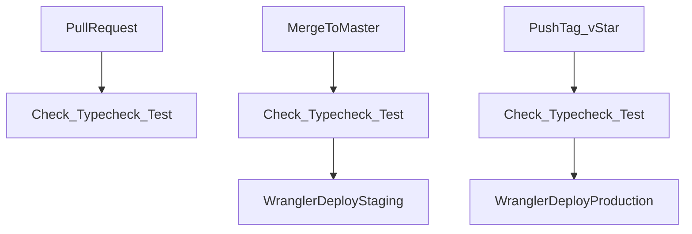

# Wrangler API Deploy Automation

## Current State
- The only workflow is [` .github/workflows/ci.yml`](.github/workflows/ci.yml), which runs `pnpm check` on pushes to `master`/`main` and pull requests.
- The API package already depends on Wrangler and has a generic deploy script in [`apps/api/package.json`](apps/api/package.json):

```json
"deploy": "wrangler deploy --minify"
```

- [`apps/api/wrangler.jsonc`](apps/api/wrangler.jsonc) already defines `env.staging` and `env.production`, but its build hook calls `pnpm exec turbo build --filter=api` while the API package has no `build` script today.
- Cloudflare’s docs support deploying Workers from GitHub Actions with `cloudflare/wrangler-action@v3`, `CLOUDFLARE_API_TOKEN`, and `CLOUDFLARE_ACCOUNT_ID`, and deploying environments with `wrangler deploy --env staging` / `--env production`.

## Proposed Flow



## Implementation Plan
- Update [`apps/api/package.json`](apps/api/package.json) with explicit scripts:
  - `build`: run the API’s deploy-time validation, likely `tsc --noEmit`, so the existing Wrangler build hook has a real Turbo task.
  - `deploy:staging`: `wrangler deploy --env staging --minify`.
  - `deploy:production`: `wrangler deploy --env production --minify`.
- Add root convenience scripts in [`package.json`](package.json), matching the existing app deploy style:
  - `build:api`: `turbo build --filter=api`.
  - `deploy:api:staging`: `pnpm build:api && pnpm --filter api deploy:staging`.
  - `deploy:api:production`: `pnpm build:api && pnpm --filter api deploy:production`.
- Adjust [`apps/api/wrangler.jsonc`](apps/api/wrangler.jsonc) so environment-specific non-secret values are set as `vars` under both `env.staging` and `env.production`:
  - `ENVIRONMENT`: `staging` / `production`.
  - `LOG_LEVEL`: usually `info`.
  - `CORS_ORIGIN`: staging and production origin values, using placeholders if the final domains are not yet known.
  - Keep `DATABASE_URL` and `LOGTAIL_SOURCE_TOKEN` as Cloudflare secrets, not committed vars.
- Add a dedicated deploy workflow, likely [` .github/workflows/deploy-api.yml`](.github/workflows/deploy-api.yml):
  - Trigger staging on `push` to `master` with path filters for `apps/api/**`, shared packages/config, lockfile, and workflow changes.
  - Trigger production on pushed tags matching `v*`.
  - Use `actions/checkout`, `pnpm/action-setup@v4`, `actions/setup-node@v4`, `pnpm install --frozen-lockfile`.
  - Run gates before deploying: `pnpm check`, `pnpm --filter api typecheck`, and `pnpm --filter api test`.
  - Deploy via `cloudflare/wrangler-action@v3` with `workingDirectory: apps/api` and command `deploy --env staging --minify` or `deploy --env production --minify`.
  - Use GitHub Actions `environment: staging` and `environment: production` so production can have required reviewers or protected secrets if desired.
- Add setup documentation to [`README.md`](README.md) or an API-specific deploy doc:
  - Required GitHub secrets: `CLOUDFLARE_ACCOUNT_ID`, `CLOUDFLARE_API_TOKEN`.
  - Required Cloudflare Worker secrets per environment: `DATABASE_URL`, `LOGTAIL_SOURCE_TOKEN`, optional `LOGTAIL_ENDPOINT`.
  - Example commands: `pnpm --filter api wrangler secret put DATABASE_URL --env staging` and equivalent production commands.
  - Release process: merge to `master` for staging, push `vX.Y.Z` for production.

## Defaults I’ll Use
- Production deploys on pushed tags matching `v*`, for example `v1.2.3`.
- Automatic database migrations will not be part of this first deploy workflow. The API has Drizzle config, but no migration files are present yet, so migrations should be added as a separate explicit release step once the migration policy is clear.
- I’ll keep the existing CI workflow and add deploy automation separately, so normal PR checks stay simple and deploy permissions are isolated.

## Verification
- Run `pnpm check`.
- Run `pnpm --filter api typecheck`.
- Run `pnpm --filter api test`.
- Validate workflow syntax locally by inspection and, if available, with `actionlint`.
- After secrets are configured, verify staging with a merge to `master`, then verify production with a test release tag such as `v0.1.0`.